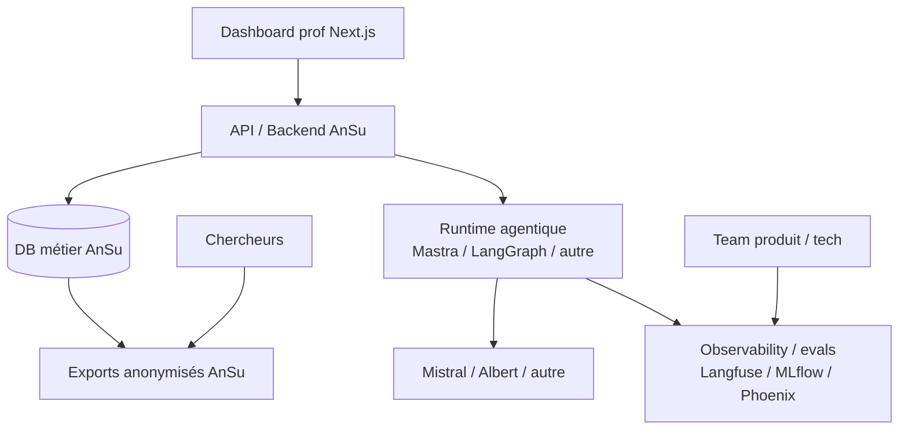

# Benchmark frameworks agentiques — AnSu v5

Ce repo sert à comparer les briques techniques possibles pour le POC agentique AnSu : **runtimes agentiques** (Mastra, LangChain, LangGraph), **observability / evals** (Langfuse, MLflow, Phoenix), providers LLM et playground de test. On y trouve à la fois les **documents de décision** du benchmark et les **POC exécutables en local** pour tester un agent naïf, ses traces, ses scores et ses sorties structurées.

## À lire en premier

| Document                                                                                                                 | Rôle                                                                               |
| ------------------------------------------------------------------------------------------------------------------------ | ---------------------------------------------------------------------------------- |
| [`docs/benchmark-agentique/README.md`](./docs/benchmark-agentique/README.md)                                             | Point d'entrée décisionnel : méthode, architecture cible, synthèse des choix.      |
| [`pocs/README.md`](./pocs/README.md)                                                                                     | Point d'entrée technique : structure des POC, playground commun, commandes utiles. |
| [`docs/benchmark-agentique/SYNTHESE_OBSERVABILITY_EVALS.md`](./docs/benchmark-agentique/SYNTHESE_OBSERVABILITY_EVALS.md) | Synthèse détaillée Langfuse / MLflow / Phoenix.                                    |
| [`docs/benchmark-agentique/SYNTHESE_RUNTIME.md`](./docs/benchmark-agentique/SYNTHESE_RUNTIME.md)                         | Synthèse détaillée Mastra / LangChain / LangGraph.                                 |

## Architecture visée



## Lancer la stack en local

Prérequis :

- Docker + Docker Compose ;
- [`task`](https://taskfile.dev/) pour utiliser les commandes du [`Taskfile.yml`](./Taskfile.yml) ;
- optionnel : un fichier `.env` à la racine avec une clé modèle (`MISTRAL_API_KEY`, Albert, etc.). Sans clé, certains POC peuvent tourner en mode mock selon leur configuration.

### Stack complète

```bash
# Lancer tous les services du benchmark
task up

# Afficher les URLs disponibles
task urls

# Générer des données de démonstration historiques
task seed
```

La commande `task up` lance notamment : Phoenix, MLflow, Langfuse, les runtimes Mastra / LangGraph et le playground commun.

Principales URLs :

| Service              | URL                   |
| -------------------- | --------------------- |
| Playground benchmark | http://localhost:3013 |
| Langfuse             | http://localhost:3012 |
| MLflow               | http://localhost:5001 |
| Phoenix              | http://localhost:6006 |
| Mastra API           | http://localhost:4111 |
| Mastra Studio        | http://localhost:4112 |

### Lancement ciblé recommandé pour travailler vite

Pour tester le playground avec une stack plus légère :

```bash
task langfuse:up
task langgraph-ts:up
task playground:dev
```

Puis ouvrir :

```txt
http://localhost:3013
```

## Commandes utiles

```bash
# Voir l'état des conteneurs
task ps

# Arrêter sans supprimer les volumes
task down

# Arrêter et supprimer les volumes de démo
task clean

# Vérifier les variables d'environnement chargées
task env:check
```

Pour les commandes détaillées par outil (`langfuse:*`, `mlflow:*`, `phoenix:*`, `mastra:*`, `langgraph:*`), utiliser :

```bash
task --list
```
