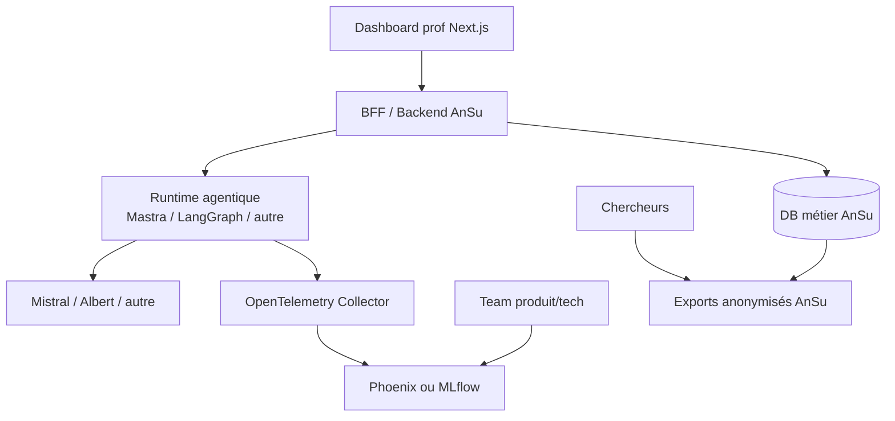

# Benchmark frameworks agentiques — AnSu v2

Ce dossier regroupe les POC et conclusions intermédiaires pour choisir les briques techniques de la future fabrique d'agents AnSu.

## Objectif

Comparer des solutions capables d'aider AnSu à construire, observer et évaluer un premier **agent naïf** d'ici octobre, tout en gardant une trajectoire qui permette de continuer de construire proprement ensuite : versioning d'agents, marketplace, recherche, preuve d'impact et déploiement sur un socle compatible.

Le benchmark ne cherche pas seulement un chatbot. Il cherche une trajectoire pour :

- maintenir une posture naïve ;
- empêcher la dérive vers l'expertise ;
- tracer les dialogues ;
- évaluer la non-régression ;
- exposer une UI prof Next.js ;
- fournir des données anonymisées aux chercheurs ;
- rester compatible self-host / socle / SecNumCloud.

## Documents principaux

| Fichier | Rôle |
|---|---|
| [`GRILLE_EVALUATION.md`](./docs/benchmark-agentique/GRILLE_EVALUATION.md) | **Document méthodo principal** : catégories d'outils, protocole par catégorie, must-have POC, notation, fiches outil/brique/scénario. |
| [`docs/benchmark-agentique/QUESTIONS_STRUCTURANTES.md`](./docs/benchmark-agentique/QUESTIONS_STRUCTURANTES.md) | Tableau de pilotage des questions à résoudre, avec statuts et liens vers les preuves/fiches. |
| [`docs/benchmark-agentique/SYNTHESE_RUNTIME.md`](./docs/benchmark-agentique/SYNTHESE_RUNTIME.md) | Synthèse provisoire des runtimes agentiques et décision Mastra à challenger. |
| [`docs/z_archive/FRAMEWORK_EVALUATION_CRITERIA.md`](./docs/z_archive/FRAMEWORK_EVALUATION_CRITERIA.md) | Ancienne grille produit détaillée, conservée comme banque de critères métier. |
| [`PHOENIX_CONCLUSIONS.md`](./docs/z_archive/PHOENIX_CONCLUSIONS.md) | Conclusions provisoires sur Arize Phoenix. |
| [`MLFLOW_CONCLUSIONS.md`](./docs/z_archive/MLFLOW_CONCLUSIONS.md) | Conclusions provisoires sur MLflow. |
| [`mastra-runtime/README.md`](./mastra-runtime/README.md) | POC Mastra runtime + Next + Studio/evals/observability. |

## Typologie des solutions testées

La méthode active est décrite dans [`GRILLE_EVALUATION.md`](./docs/benchmark-agentique/GRILLE_EVALUATION.md). Elle sépare les tests par catégorie puis décide sur des scénarios d'architecture complets.

### A. Runtimes agentiques

Question principale : **peut-on exécuter l'agent naïf AnSu derrière une façade API stable, avec mémoire, traces, scorer et provider interchangeable ?**

Vague 1 :

| Candidat | Rôle testé | Statut |
|---|---|---|
| Mastra | Runtime agentique TypeScript intégré | POC en cours, mémoire native validée |
| Runtime AnSu minimal TS + Vercel AI SDK | Runtime maison minimal TypeScript | À tester après LangGraph/LangChain |
| LangGraph / LangChain Python derrière API AnSu | Runtime agentique mature en service séparé | Prochain runtime à tester |

### B. Observability / evals / feedback

Question principale : **où stocker, relire, évaluer, comparer et exporter les traces AnSu ?**

Vague 1 :

| Brique | Rôle testé | Statut |
|---|---|---|
| Phoenix | Traces, annotations, datasets, evals | POC testé |
| MLflow GenAI | Tracking, registry, trace-based evals | POC testé |
| Mastra Observability / Scorers | Observability native attachée au runtime Mastra | À tester séparément en catégorie B |
| Langfuse | LLM observability, prompts, evals | À tester |
| Promptfoo | Golden datasets, tests CI, non-régression | À tester |

### C/D. Provider et knowledge

Albert API est le provider cible pressenti, mais les tests détaillés sont reportés à réception de la clé. En attendant, Mistral direct sert de provider de test runtime. Le RAG/knowledge est évalué seulement en compatibilité légère pour le moment.

### UI Next de benchmark

Les runtimes de vague 1 doivent être testés via une UI Next commune et minimaliste : même contrat API, même expérience multi-tour, mêmes informations de debug. Design sobre par défaut : console fonctionnelle, peu de couleurs, pas d’animations décoratives ni d’effets visuels inutiles. Cette UI doit aussi intégrer un onglet ou panneau **DX & notes d’évaluation** pour capturer pendant les tests les points forts/faibles, pièges de câblage, qualité de documentation et verdict provisoire.

## Licence, gratuité et self-host

Vérification faite au 2026-06-15. À revalider avant décision finale ou intégration dans un repo partagé avec Thomas.

Légende :

- ✅ **OSS OSI** : licence open source standard type Apache-2.0/MIT, utilisable gratuitement en self-host.
- 🟡 **Source-available gratuit** : code disponible et self-host gratuit, mais licence non OSI ou restrictions enterprise.
- ❌ **Non retenu seul** : dépendance SaaS/propriétaire/payant pour une capacité critique.

| Brique | Licence / gratuité constatée | Statut pour AnSu | Notes |
|---|---|---|---|
| MLflow | Apache-2.0 | ✅ OSS OSI | Self-host gratuit. Bon candidat pour tracking/evals/prompt registry. |
| Phoenix | Elastic License 2.0 | 🟡 Source-available gratuit | Self-host gratuit et sans feature gates selon doc Phoenix, mais ELv2 n'est pas une licence OSI type Apache/MIT. À valider juridiquement si usage institutionnel. |
| Mastra core | Apache-2.0 hors dossiers `ee/` | 🟡 Majoritairement OSS OSI | Core Apache-2.0 ; fonctionnalités `ee/` sous licence enterprise, gratuites en dev/test mais licence requise en production. À tester sans dépendance `ee`. |
| LangGraph / LangChain | MIT | ✅ OSS OSI | Runtime Python OSS. Attention : LangSmith est une offre séparée pour observabilité/evals ; ne pas le considérer gratuit/self-host par défaut. |
| Vercel AI SDK | Apache-2.0 | ✅ OSS OSI | SDK TS/Next gratuit. Vercel plateforme cloud non requise. |
| Langfuse core | MIT, sauf dossiers `ee/` | 🟡 OSS core + enterprise | Core self-host gratuit ; certaines fonctions enterprise (RBAC fin, audit logs, rétention, etc.) nécessitent licence. |
| Next.js | MIT | ✅ OSS OSI | Utilisé seulement pour dashboards POC / UI AnSu. Vercel cloud non requis. |
| OpenTelemetry | Apache-2.0 | ✅ OSS OSI | Standard transverse pour traces. |
| Docker Engine / Compose | OSS côté moteur/compose | ✅ pour cible Linux | Docker Desktop a sa propre licence commerciale ; pour un repo infra/Thomas, privilégier cible Docker Engine Linux ou Kubernetes. |

Principe de décision AnSu : éviter toute capacité critique qui impose un SaaS propriétaire ou une licence payante. Les briques 🟡 restent candidates si le POC et la prod peuvent utiliser uniquement la partie gratuite/self-host conforme.

## Lancement rapide avec Docker

Prérequis : Docker + Docker Compose. Le fichier [`Taskfile.yml`](./Taskfile.yml) centralise les commandes. Si `task` n'est pas installé, les commandes Docker Compose équivalentes sont visibles dans le Taskfile.

```bash
# Tout lancer : Phoenix + MLflow + dashboards
task up

# Générer les données de démo
task seed

# Voir les conteneurs
task ps

# Arrêter sans supprimer les volumes
task down

# Arrêter et supprimer les volumes de démo
task clean
```

URLs :

| Démo | UI outil | Dashboard Next |
|---|---|---|
| Phoenix | http://localhost:6006 | http://localhost:3007 |
| MLflow | http://localhost:5001 | http://localhost:3008 |
| Mastra | API http://localhost:4111 / Studio http://localhost:4112 | http://localhost:3009 |

Commandes ciblées :

```bash
# Phoenix
task phoenix:up
task phoenix:seed
task phoenix:logs
task phoenix:down

# MLflow
task mlflow:up
task mlflow:seed
task mlflow:eval
task mlflow:logs
task mlflow:down
```

Les jobs `phoenix-app`, `mlflow-app`, `mlflow-eval` et `mastra-seed` sont volontairement des jobs ponctuels Docker Compose sous profiles : ils ne tournent pas en continu avec les dashboards.

## POC disponibles

### Phoenix + LangChain

Chemin :

```txt
phoenix-langchain/
```

Contenu :

- Phoenix self-hosté Docker ;
- fake agent LangChain instrumenté OpenTelemetry/OpenInference ;
- spans agent, guardrails, retriever, evaluator ;
- mini dashboard Next.js sur Phoenix REST ;
- tests prompt/evals/annotations/datasets.

Dashboard Next :

```txt
phoenix-langchain/dashboard-next/
http://localhost:3007
```

Conclusion courte : Phoenix est très bon pour **observabilité LLM**, **traces**, **datasets**, **evals**, **annotations**, mais ne fournit pas le runtime agentique ni le registry métier AnSu.

### MLflow GenAI

Chemin :

```txt
mlflow-genai/
```

Contenu :

- MLflow server local ;
- fake agent naïf instrumenté `@mlflow.trace` ;
- prompt registry avec variables ;
- trace-based eval avec scorer custom ;
- mini dashboard Next.js avec REST MLflow pour traces/runs et BFF Python SDK pour Prompt Registry.

Dashboard Next :

```txt
mlflow-genai/dashboard-next/
http://localhost:3008
```

Conclusion courte : MLflow est très fort pour **prompt registry**, **trace-based evals**, **MLOps**, **preuve d'impact**, **licence Apache-2.0**, mais ne fournit pas non plus le runtime agentique ni la couche métier AnSu.


### Mastra Runtime + Next

Chemin :

```txt
mastra-runtime/
```

Contenu :

- Mastra server local avec API ;
- Mastra Studio lancé séparément ;
- agent naïf AnSu `agent-naif-ansu` ;
- scorer custom `ansu-naivety-contract` ;
- observability native Mastra via LibSQL + `MastraStorageExporter` ;
- dashboard Next.js pour tester un tour élève ;
- mode mock gratuit/offline et mode réel Mistral avec `MISTRAL_API_KEY`.

Dashboard Next :

```txt
mastra-runtime/app/
http://localhost:3009
```

Conclusion courte : Mastra est le premier POC de la famille **runtime agentique**. Il porte déjà l'agent naïf AnSu avec mémoire native Mastra, scorer, traces et dashboard Next minimal. Il doit encore être évalué sur façade API AnSu normalisée, exportabilité, compat Albert et éventuelle complémentarité avec Phoenix/MLflow/Langfuse.

## État de comparaison rapide

| Besoin | Phoenix | MLflow | Mastra |
|---|---|---|---|
| Nature de la brique | Observabilité/evals partielle | AI engineering/evals/registry partiel | Runtime agentique tout-en-un |
| Runtime agentique | ❌ Non | ❌ Non | ✅ Oui, POC |
| Observabilité traces LLM | ✅ Très fort | ✅ Très fort | ✅ Native, à approfondir |
| OpenTelemetry | ✅ Très fort | ✅ Très fort | 🟡 Export possible, à tester |
| Prompt registry | 🟡 Partiel, REST rugueux | ✅ Fort, testé | 🟡 À tester / pas cible POC |
| Variables de prompt | ❌ Placeholders seulement | 🟡 Variables extraites, schema métier absent | 🟡 Instructions dynamiques testées |
| Evals / non-régression | ✅ Fort | ✅ Très fort | ✅ Scorer custom POC |
| Recherche / preuve d'impact | 🟡 Bon potentiel | ✅ Très fort potentiel | 🟡 À évaluer |
| UI prof | ❌ À construire | ❌ À construire | ❌ À construire, dashboard POC seulement |
| API Next / BFF | ✅ REST POC validé | 🟡 REST + SDK/BFF recommandé | ✅ Next route vers Mastra API |
| Licence / gratuité | 🟡 ELv2, self-host gratuit, non OSI | ✅ Apache-2.0 OSS | 🟡 Core Apache-2.0 hors `ee/` |
| Self-host / socle | 🟡 Bon potentiel | 🟡 Bon potentiel, auth prod à cadrer | 🟡 Bon potentiel, Studio à protéger par infra |

## Architecture qui se dessine



Le prochain choix structurant n'est donc pas Phoenix vs MLflow seulement, mais le **runtime agentique** à brancher sur l'une de ces briques d'observation/évaluation.

## Prochains candidats probables

- Mastra d'abord seul : runtime + observability native + scorers natifs + stockage/studio ;
- puis Mastra + export OpenTelemetry/Phoenix/MLflow si nécessaire ;
- LangGraph/LangChain comme alternative runtime Python ;
- Vercel AI SDK comme option TS/Next simple pour POC agent + streaming ;
- éventuellement autre runtime agentique compatible TypeScript, OpenTelemetry et self-host.
