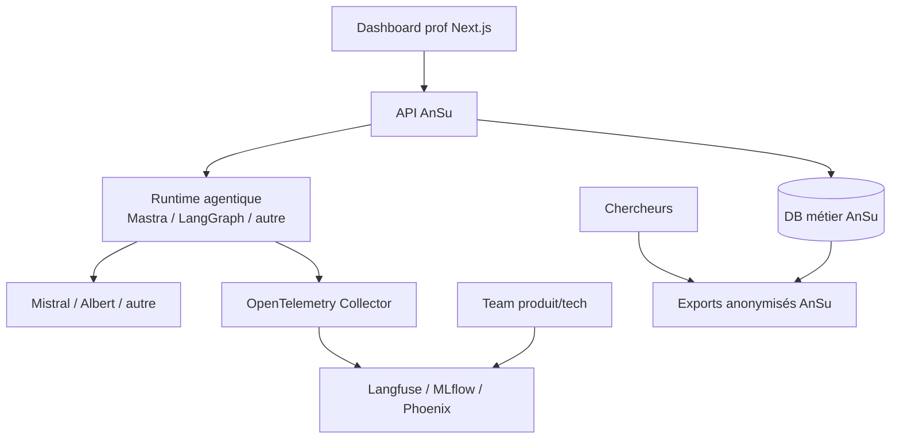

# Benchmark agentique AnSu — point d'entrée

> Objet : document d'entrée pour présenter rapidement les décisions issues du benchmark agentique AnSu.

Ce dossier regroupe les éléments de décision autour de deux sujets distincts :

1. **le runtime agentique** — le moteur qui exécute l'agent ;
2. **l'observability / evals** — la plateforme qui permet de comprendre, scorer et améliorer ce que fait l'agent.

---

## 1. Méthodologie

### Ce qu'on a testé

**Côté observability / evals** — trois plateformes open source, toutes déployables sur notre propre infrastructure :

| Outil        | Ce qu'il fait                                                                          | Licence                                       |
| ------------ | -------------------------------------------------------------------------------------- | --------------------------------------------- |
| **Langfuse** | Plateforme d'observability LLM : traces, scores, datasets, prompts.                    | MIT (cœur) + commercial (features Enterprise) |
| **MLflow**   | Plateforme MLOps : traces, évaluations, datasets, non-régression.                      | Apache 2.0                                    |
| **Phoenix**  | Observability basée sur OpenTelemetry / OpenInference : traces, exports data, prompts. | Elastic License 2.0                           |

**Côté runtime agentique** — trois moteurs capables d'exécuter un agent :

| Outil         | Ce qu'il fait                                                       | Stack               |
| ------------- | ------------------------------------------------------------------- | ------------------- |
| **Mastra**    | Runtime agentique moderne, natif TypeScript.                        | TypeScript          |
| **LangChain** | Framework agentique mature, simple pour workflows linéaires.        | Python / TypeScript |
| **LangGraph** | Runtime orienté graphes, pour workflows non linéaires et complexes. | Python / TypeScript |

### Comment on a testé

Le benchmark observability a été mené sur un **runtime unique** — LangGraph Python — volontairement choisi comme cas exigeant : un graphe agentique produit plusieurs étapes (appels LLM, routage, tools, réponse finale), ce qui permet de vérifier si chaque plateforme sait restituer une exécution structurée.

On a défini **11 critères** (B1 à B11) couvrant : souveraineté, intégration runtime, lisibilité des traces, scores, sorties structurées, coûts/impacts Albert, prompts, portabilité, DX, production technique, accès équipe.

Chaque critère a été validé en pratique, avec captures d'écran, sur les trois outils en parallèle.

---

## 2. Petit schéma d'architecture finale (WIP)

---

## 3. Documents recommandés

Pour préparer ou suivre la présentation :

1. [`SYNTHESE_OBSERVABILITY_EVALS.md`](./SYNTHESE_OBSERVABILITY_EVALS.md)
   Décision principale sur les outils d'observability et d'évaluation.

2. [`SYNTHESE_RUNTIME.md`](./SYNTHESE_RUNTIME.md)
   Synthèse runtime : Mastra, LangChain, LangGraph.

3. [`GRILLE_EVALUATION.md`](./GRILLE_EVALUATION.md)
   Grille de critères utilisée pour cadrer l'analyse.

4. [`TRACES_PRIORITAIRES.md`](./TRACES_PRIORITAIRES.md)
   Informations attendues dans les traces AnSu.

---

## 4. Synthèse des décisions

### Observability / evals

**Recommandation : Langfuse**, sous réserve de faisabilité technique sur l'infra Scaleway.

C'est l'outil le plus lisible pour comprendre rapidement ce que fait l'agent : relire une trace, voir les scores, consulter les sorties structurées et partager ces constats dans l'équipe.

| Outil        | Verdict                                                                                                                                                                      |
| ------------ | ---------------------------------------------------------------------------------------------------------------------------------------------------------------------------- |
| **Langfuse** | Favori pour le POC. Traces agentiques les plus lisibles, scores bien visibles, expérience confortable. Réserve : infra la plus lourde (Postgres, ClickHouse, Redis, MinIO).  |
| **MLflow**   | Alternative solide. Infra la plus simple, excellent pour evals / non-régression. Moins immédiat pour une lecture produit.                                                    |
| **Phoenix**  | À écarter comme solution principale. Traces agentiques peu lisibles, graphe LangGraph mal restitué. Intéressant seulement si la gestion avancée de prompts devient centrale. |

### Runtime agentique

**Recommandation : deux options en discussion** selon le niveau de complexité à assumer dès le POC.

| Outil         | Verdict                                                                                                                      |
| ------------- | ---------------------------------------------------------------------------------------------------------------------------- |
| **Mastra**    | Favori si priorité à un POC TypeScript rapide, lisible et proche du produit.                                                 |
| **LangGraph** | Favori si priorité à anticiper des workflows non linéaires avec une orchestration explicite.                                 |
| **LangChain** | Utile comme brique et écosystème, mais moins discriminant comme runtime principal si les workflows deviennent non linéaires. |

### Points restant à vérifier avant décision finale

- faisabilité de Langfuse sur l'infra Scaleway : déploiement, maintenance, sauvegarde, restauration ;
- éventuel besoin SSO / Keycloak ;
- stratégie données sensibles : anonymisation, rétention, accès aux traces ;
- câblage des métadonnées Albert (`cost`, `impacts`) comme cas d'école metadata custom ;
- validation rapide avec le runtime final retenu, en réutilisant le playground et les scénarios existants.
