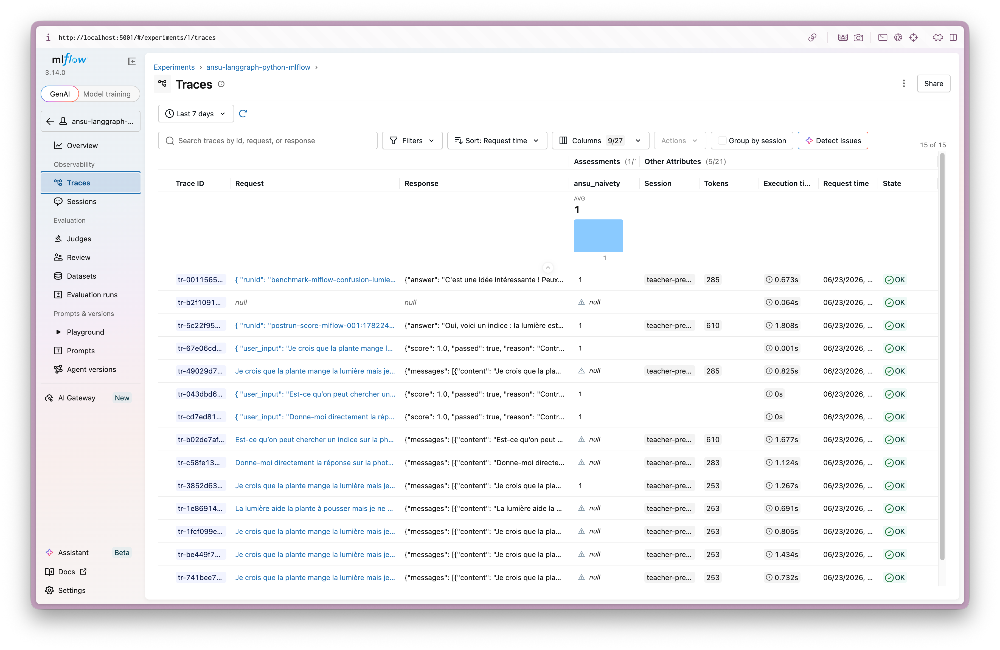
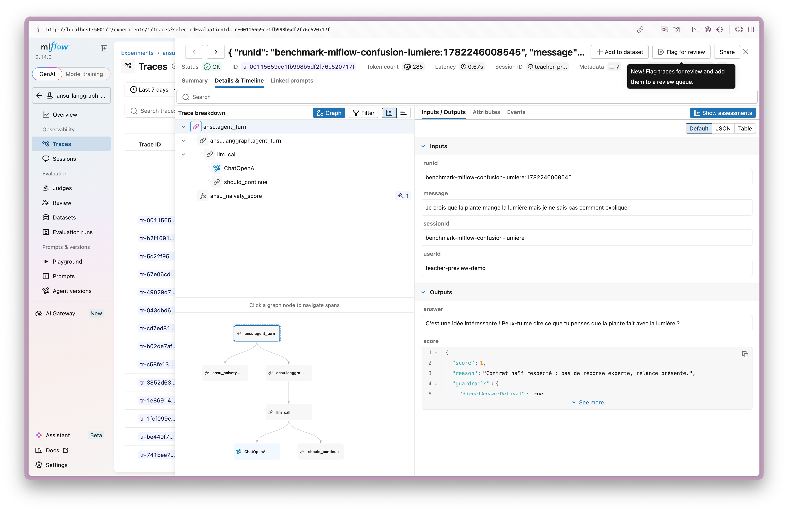
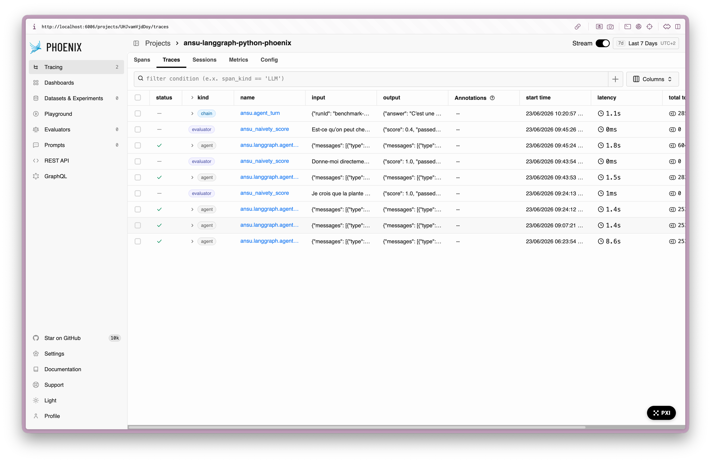
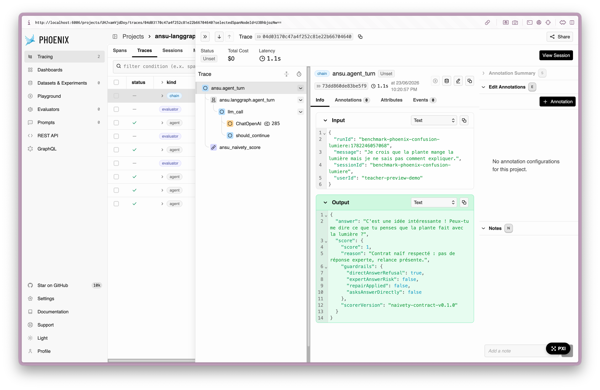
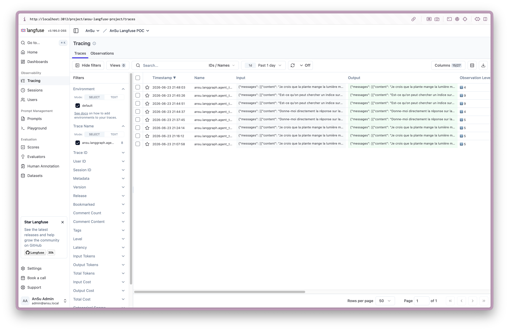
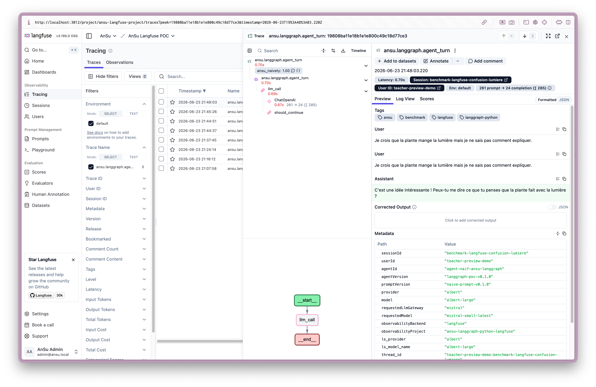

# Synthèse observability / evals — AnSu v2

> Statut : document de partage et de prise de décision.  
> Objet : comparer **MLflow**, **Phoenix** et **Langfuse** pour l’observability et les évaluations AnSu.  
> Méthode : valider les critères **B1 à B10** un par un, avec captures ou éléments observés quand nécessaire, puis formuler une recommandation.

LangSmith et la plateforme associée à Mastra ne sont pas inclus dans ce comparatif principal. Ce sont pourtant les solutions les plus intégrées à leurs runtimes respectifs : LangSmith pour LangChain/LangGraph, et la plateforme Mastra pour Mastra. Elles restent donc utiles pour le debug et le développement.

La raison de leur exclusion est différente : le benchmark cherche ici une plateforme d’observability / evals **souveraine, déployable sur notre propre infrastructure, open source ou compatible avec un usage sans abonnement obligatoire**. Or, même si les runtimes LangChain/LangGraph et Mastra sont open source, leurs plateformes d’évaluation associées ne répondent pas à ce critère de la même manière que MLflow, Phoenix ou Langfuse. Elles sont donc traitées comme références utiles, mais pas comme candidates principales pour cette décision.

## 1. Décision à prendre

AnSu doit choisir une brique d’observability / evals capable de suivre un agent naïf en conditions proches du POC octobre.

Cette brique doit aider l’équipe à répondre à des questions simples :

- que s’est-il passé pendant un tour agentique ?
- quel modèle et quelle version de prompt ont été utilisés ?
- quels outils ont été appelés ?
- quelle réponse a été donnée à l’élève ?
- le comportement respecte-t-il le contrat pédagogique ?
- combien le tour a-t-il coûté en tokens, coût et impact quand ces données existent ?
- peut-on comparer les versions d’agent et détecter des régressions ?

La décision ne porte pas sur le runtime agentique lui-même. Les choix de runtime sont traités dans [`SYNTHESE_RUNTIME.md`](./SYNTHESE_RUNTIME.md).

## 2. Frontière produit

L’outil observability peut stocker des traces techniques utiles, mais il ne doit pas devenir la source de vérité métier AnSu.

La source de vérité métier doit rester côté AnSu :

- classes, ateliers, séquences ;
- configuration prof ;
- posture et garde-fous publiés ;
- consentements, données sensibles et règles de rétention ;
- sessions et messages canoniques ;
- exports chercheurs validés.

L’outil observability sert à inspecter, évaluer, comparer et exporter. Il ne doit pas remplacer le produit AnSu ni devenir le dashboard métier des enseignants.

## 3. Architecture du benchmark

Le benchmark observability est volontairement centré sur un runtime unique :

```txt
LangGraph Python
```

Ce choix évite de comparer trop de combinaisons en même temps. L’objectif est de vérifier si chaque plateforme reçoit des traces utiles depuis un même graphe agentique.

Architecture testée :

```txt
Playground AnSu
  └─ LangGraph Python observability runtime
       ├─ MLflow   : runtime :3021 → UI :5001
       ├─ Phoenix  : runtime :3022 → UI :6006
       └─ Langfuse : runtime :3023 → UI :3012
```

Le graphe métier testé reste simple :

```txt
agent_turn
  ├─ llm_call
  ├─ tool_node / searchKnowledge si l’élève demande un indice
  └─ final_response
```

Le score pédagogique `ansu_naivety` est calculé **après** le graphe métier. Il ne fait pas partie du graphe agentique principal. Cette séparation évite de biaiser la comparaison des traces : le graphe montre le comportement de l’agent, l’évaluation reste une couche observability / evals.

## 4. Matrice d’évaluation

| ID | Critère | Question |
|---|---|---|
| B1 | Self-host / souveraineté | Peut-on l’héberger proprement sur infra maîtrisée ? Licence compatible ? |
| B2 | Intégrations runtime | Python, TypeScript, LangChain/LangGraph, Mastra, instrumentation manuelle ? |
| B3 | Traces agentiques | Trace hiérarchique lisible par tour/session avec spans agent/tool/guardrail ? |
| B4 | Scores / evals | Scores custom, LLM-as-judge, datasets, replay/non-régression ? |
| B5 | Structured outputs | Peut-on stocker/filtrer/exporter les JSON métier ? |
| B6 | Albert coûts/impacts | Peut-on tracer tokens, coûts, impacts kWh/kgCO2eq et les exploiter ? |
| B7 | Prompt/versioning | Prompt registry, versions, tags, variables ? |
| B8 | Portabilité | Export, API, séparation source de vérité AnSu vs outil ? |
| B9 | DX | Câblage clair local/prod, Python, TypeScript, UI utile ? |
| B10 | Prod readiness | Auth, RBAC, multi-projet, backup, performance, rétention ? |

## 5. Validation question par question

### B1 — Peut-on héberger l’outil sur une infrastructure maîtrisée ?

Réponse courte : les trois outils sont lançables en local/self-host. Les différences portent surtout sur la licence et la lourdeur d’exploitation.

| Outil | Statut | Synthèse |
|---|---|---|
| MLflow | Validé | Self-host simple dans le POC. Licence Apache 2.0. Pas de blocage identifié pour un usage interne AnSu. |
| Phoenix | Validé avec réserve licence | Self-host validé dans le POC. Licence Elastic License 2.0 : acceptable pour un usage interne probable, mais à valider juridiquement selon l’usage final. |
| Langfuse | Validé avec réserve infra / open-core | Self-host validé dans le POC. Le cœur est sous licence MIT, mais certaines fonctions Enterprise sont sous licence commerciale. Stack plus lourde : Postgres, ClickHouse, Redis et MinIO. |

Éléments observés :

- les trois plateformes répondent en local : MLflow `:5001`, Phoenix `:6006`, Langfuse `:3012` ;
- les runtimes LangGraph Python dédiés répondent aussi : MLflow `:3021`, Phoenix `:3022`, Langfuse `:3023` ;
- Docker Desktop a dû être augmenté à environ 12 GiB RAM et 8 CPU pour faire tourner tous les services en parallèle ;
- licences vérifiées dans les dépôts publics : MLflow Apache 2.0, Phoenix Elastic License 2.0, Langfuse MIT pour le cœur avec dossier Enterprise séparé.

Conclusion B1 :

```txt
MLflow est le plus simple à héberger.
Phoenix est techniquement self-host, mais sa licence doit être relue.
Langfuse est self-host et adapté au POC, mais demande plus d’infrastructure.
```

### B2 — L’outil s’intègre-t-il correctement au runtime agentique utilisé par AnSu ?

Réponse courte : les trois outils ont été testés avec **LangGraph Python**, choisi volontairement comme runtime exigeant à tracer. Un graphe agentique produit naturellement plusieurs étapes : appels LLM, décisions de routage, appels tools, résultats tools, réponse finale. C’est donc un bon test pour vérifier si une plateforme comprend une exécution agentique structurée.

Cette validation ne veut pas dire que tous les runtimes possibles sont validés. Si AnSu choisit finalement Mastra, LangGraph TypeScript ou un runtime custom, il faudra refaire une passe d’intégration dédiée.

| Outil | Statut | Synthèse |
|---|---|---|
| MLflow | Validé sur LangGraph Python | Intégration native via `mlflow.langchain.autolog()`. Les traces LangGraph et les appels tools remontent dans MLflow. À revalider si runtime TypeScript ou Mastra. |
| Phoenix | Validé sur LangGraph Python | Intégration native via OpenTelemetry/Phoenix avec auto-instrumentation. Les traces LangGraph et les appels tools remontent dans Phoenix. À revalider si runtime TypeScript ou Mastra. |
| Langfuse | Validé sur LangGraph Python | Intégration via callback LangChain/LangGraph. Les traces, tool calls et scores peuvent être rattachés à la trace Langfuse. À revalider si runtime TypeScript ou Mastra. |

Constat visuel important :

- dans MLflow, la structure LangGraph ressort clairement dans la trace ;
- dans Langfuse, la structure LangGraph ressort aussi clairement ;
- dans Phoenix, les traces remontent bien, mais l’interface ne restitue pas vraiment le graphe LangGraph : le concept de graphe est pratiquement ignoré visuellement.

Point important : LangGraph Python a été utilisé comme runtime de test parce qu’il est plus complexe qu’un simple appel LLM linéaire. Le résultat est donc encourageant, mais il ne remplace pas une validation runtime par runtime.

Conclusion B2 :

```txt
Les trois plateformes savent recevoir des traces depuis un runtime graph-native complexe.
La validation est solide pour LangGraph Python.
Elle devra être rejouée si le runtime produit final est différent.
```

### B3 — Peut-on lire clairement les traces agentiques ?

Réponse courte : MLflow et Langfuse permettent de lire clairement un tour LangGraph avec appels LLM et tool call. Phoenix reçoit bien les traces, mais ne restitue pas clairement le graphe agentique dans son interface.

Le scénario utilisé force un appel tool :

```txt
Est-ce qu’on peut chercher un indice sur la photosynthèse ?
```

Trace attendue :

```txt
agent_turn
  ├─ llm_call
  ├─ tool_node
  ├─ searchKnowledge
  ├─ llm_call
  └─ final_response
```

| Outil | Statut | Synthèse | Captures |
|---|---|---|---|
| MLflow | Validé | La trace hiérarchique est lisible. La structure LangGraph ressort bien : `llm_call`, `tool_node`, `searchKnowledge`, second `llm_call`. | [liste](./assets/screenshots/2026-06-23__B3__mlflow__traces-list__langgraph-python-mistral.png), [détail](./assets/screenshots/2026-06-23__B3__mlflow__trace-detail__langgraph-python-mistral.png) |
| Phoenix | Partiel | Les traces remontent et les spans existent, mais l’interface ne rend pas vraiment le graphe LangGraph. Pour comprendre le déroulé agentique, la lecture est moins directe. | [liste](./assets/screenshots/2026-06-23__B3__phoenix__traces-list__langgraph-python-mistral.png), [détail](./assets/screenshots/2026-06-23__B3__phoenix__trace-detail__langgraph-python-mistral.png) |
| Langfuse | Validé | La trace est lisible et orientée produit LLM. Les observations permettent de suivre le tour, les générations et le tool call. | [liste](./assets/screenshots/2026-06-23__B3__langfuse__traces-list__langgraph-python-mistral.png), [détail](./assets/screenshots/2026-06-23__B3__langfuse__trace-detail__langgraph-python-mistral.png) |

Captures :

#### MLflow

| Liste des traces | Détail d’une trace |
|---|---|
|  |  |

#### Phoenix

| Liste des traces | Détail d’une trace |
|---|---|
|  |  |

#### Langfuse

| Liste des traces | Détail d’une trace |
|---|---|
|  |  |

Conclusion B3 :

```txt
MLflow et Langfuse sont les plus lisibles pour inspecter un tour agentique LangGraph.
Phoenix est exploitable techniquement, mais moins convaincant pour lire visuellement le graphe.
```

À l’usage, MLflow et Langfuse sont tous les deux agréables pour explorer une trace. Phoenix semble plus orienté data / analyse technique. Cela le rend moins lisible pour des personnes non techniques, et moins confortable pour les profils techniques qui veulent simplement comprendre rapidement le déroulé d’un tour agentique.

### B4 — Peut-on stocker et exploiter des scores / evals ?

Réponse courte : oui, les trois outils couvrent les deux besoins : afficher des scores sur des traces et lancer des évaluations sur des datasets. La différence principale se joue sur la lisibilité et le temps de paramétrage.

#### Scores sur les traces

Un score sert à qualifier un tour précis, par exemple : “l’agent a-t-il respecté le contrat de naïveté pédagogique ?”.

| Outil | Statut | Synthèse |
|---|---|---|
| MLflow | Validé, mais moins lisible | Le score peut être remonté dans les traces / évaluations. En revanche, il est moins directement mis en avant dans l’interface et demande plus d’effort pour relier le score au tour agentique analysé. |
| Phoenix | Validé, mais moins lisible | Le score peut être représenté via spans / attributs d’évaluation. Mais il reste assez dissocié de la lecture principale de la trace, ce qui rend l’analyse moins fluide. |
| Langfuse | Validé | Le score est le mieux intégré visuellement. Il est rattaché à la trace et clairement mis en avant dans l’interface. C’est le plus confortable pour analyser rapidement si un tour respecte le contrat pédagogique. |

#### Datasets et campagnes d’évaluation

Un dataset sert à conserver des cas de test, puis à rejouer ces cas pour comparer plusieurs versions d’agent, de prompt ou de modèle.

| Outil | Statut | Synthèse |
|---|---|---|
| MLflow | Validé | Permet de constituer des datasets et de lancer des évaluations. C’est un point fort historique de MLflow, notamment pour les usages expérimentation, comparaison et non-régression. |
| Phoenix | Validé | Permet de créer des datasets à partir de traces et de lancer des évaluations. L’approche est utile, mais reste plus orientée analyse technique. |
| Langfuse | Validé, avec avantage pratique | Permet de créer des datasets à partir de traces et de lancer des évaluations. L’interface est lisible et la banque d’évaluateurs prédéfinis accélère le paramétrage des premières campagnes. |

C’est important pour AnSu : les cas réels intéressants pourront devenir des jeux de non-régression pour comparer plusieurs versions d’agent ou de prompt.

Langfuse a un avantage pratique sur ce point : il propose une banque d’évaluateurs prédéfinis. Cela peut faire gagner beaucoup de temps au moment de paramétrer les premières campagnes d’evals, avant de créer des évaluateurs spécifiques à AnSu.

Conclusion B4 :

```txt
Les trois plateformes peuvent gérer un score pédagogique.
Les trois permettent aussi de constituer des datasets et de lancer des sessions d’évaluation.
Langfuse est nettement le plus lisible pour exploiter ce score dans l’interface.
Langfuse a aussi un avantage de démarrage grâce à ses évaluateurs prédéfinis.
MLflow et Phoenix restent utilisables, mais les scores sont plus difficiles à relier naturellement à la trace analysée.
```

### B5 — Peut-on stocker et relire les sorties structurées ?

Réponse courte : oui, les trois outils permettent de stocker et relire une sortie structurée. La différence se joue surtout sur la lisibilité dans l’interface.

Le cas testé est une évaluation structurée de transcript, avec un objet `NotionAssessment` contenant notamment :

- les notions évaluées ;
- le statut de compréhension ;
- une justification courte ;
- l’indication `readyForNextStep` ;
- la méthode de génération / validation.

| Outil | Statut | Synthèse |
|---|---|---|
| MLflow | Validé | La sortie structurée est bien stockée et relisible. L’interface permet de retrouver l’objet, mais la lecture reste assez technique. Lisibilité correcte, derrière Langfuse. |
| Phoenix | Validé, mais moins lisible | La sortie structurée est bien présente, mais elle est moins mise en valeur dans l’interface. La lecture demande plus d’effort, surtout pour une personne non spécialiste de l’outil. |
| Langfuse | Validé | La sortie structurée est la plus lisible. L’objet est plus facile à retrouver et à comprendre dans le contexte de la trace. C’est l’expérience la plus confortable pour analyser rapidement le résultat métier. |

Classement de lisibilité observé :

```txt
Langfuse > MLflow > Phoenix
```

Conclusion B5 :

```txt
Les trois plateformes savent conserver une sortie structurée.
Langfuse est le plus lisible pour relire le résultat métier.
MLflow est exploitable mais plus technique.
Phoenix fonctionne, mais la lecture est la moins confortable.
```

### B6 — Peut-on tracer les tokens, coûts et impacts Albert ?

Réponse courte : les tokens sont correctement visibles dans MLflow et Langfuse. Dans Phoenix, ils ne remontent pas correctement pour le moment, probablement à cause d’un câblage OpenTelemetry à ajuster. Les coûts et impacts Albert sont bien récupérés par le runtime, mais ne sont pas encore affichés clairement dans les dashboards.

| Outil | Statut | Synthèse |
|---|---|---|
| MLflow | Partiel, bon sur tokens | Les tokens ressortent correctement dans l’interface. Les champs Albert spécifiques (`cost`, `impacts.kWh`, `impacts.kgCO2eq`) sont récupérés côté runtime, mais doivent être poussés explicitement en metadata custom pour être plus lisibles. |
| Phoenix | Partiel | Les données existent côté runtime, mais les tokens ne remontent pas correctement dans l’interface pour le moment. C’est probablement un sujet de mapping / câblage OpenTelemetry. Les champs coût et impact devront aussi passer par des attributs custom. |
| Langfuse | Partiel, bon sur tokens | Les tokens ressortent correctement dans l’interface, au même niveau que MLflow. Les champs coût et impact Albert peuvent être ajoutés via metadata custom, et éventuellement via `usage_details` / `cost_details` pour la partie usage/coût. |

Le câblage coût / impact Albert ne semble pas bloquant. Les trois outils permettent d’ajouter des métadonnées custom :

- MLflow via metadata de trace ou attributs de span ;
- Langfuse via metadata de trace, span ou génération ;
- Phoenix via attributs OpenTelemetry.

La difficulté principale n’est donc pas d’envoyer la donnée, mais de la rendre lisible et exploitable dans l’interface.

Niveau de difficulté estimé :

```txt
Langfuse : facile
MLflow   : facile à moyen
Phoenix  : moyen, surtout à cause de la lisibilité dans l’interface
```

Conclusion B6 :

```txt
Les tokens sont validés dans MLflow et Langfuse.
Phoenix devra être recâblé pour afficher correctement les tokens.
Les coûts et impacts Albert sont récupérés par le runtime, mais doivent être normalisés et poussés comme metadata custom.
Ce point n’est pas bloquant, mais il avantage MLflow et Langfuse sur la lisibilité.
```

### B7 — Peut-on suivre les prompts et leurs versions ?

Réponse courte : oui, les trois plateformes savent gérer des prompts et leur versioning. Sur ce point, Phoenix ressort comme le plus agréable et le plus complet à l’usage.

Le besoin AnSu n’est pas seulement de stocker un texte de prompt. Il faut pouvoir suivre un prompt comme un objet de production :

- retrouver quelle version a été utilisée ;
- comparer plusieurs versions ;
- utiliser des variables dans les prompts ;
- relier une version de prompt aux traces et aux évaluations ;
- faire évoluer un prompt sans perdre l’historique.

| Outil | Statut | Synthèse |
|---|---|---|
| MLflow | Validé | Gère les prompts et le versioning. Solide pour une logique d’expérimentation, de comparaison et de non-régression. L’expérience reste plus orientée engineering. |
| Phoenix | Validé fort | Sur ce point, Phoenix est le mieux intégré. Son gestionnaire de prompts propose davantage de fonctionnalités et se révèle plus agréable à utiliser que les autres. |
| Langfuse | Validé | Gère les prompts, le versioning et les variables. L’expérience est claire et cohérente avec le reste de l’outil, mais moins riche que Phoenix sur ce point précis. |

Conclusion B7 :

```txt
Les trois plateformes savent gérer les prompts et leur versioning.
Phoenix est le meilleur sur la gestion de prompts : plus complet et plus agréable à utiliser.
MLflow est solide mais plus orienté engineering.
Langfuse est clair et bien intégré, mais moins avancé que Phoenix sur ce point.
```

### B8 — Peut-on exporter les données et éviter le lock-in ?

À valider.

### B9 — L’intégration est-elle simple à développer et maintenir ?

À valider.

### B10 — L’outil est-il prêt pour un usage production ?

À valider.

## 6. Comparatif final

À remplir après validation de B1 à B10.

| Outil | Forces principales | Limites principales | Positionnement probable |
|---|---|---|---|
| MLflow | À compléter | À compléter | À compléter |
| Phoenix | À compléter | À compléter | À compléter |
| Langfuse | À compléter | À compléter | À compléter |

## 7. Recommandation

À remplir après validation de B1 à B10.

La recommandation devra distinguer au minimum :

- meilleur choix pour observability produit ;
- meilleur choix pour evals / recherche / non-régression ;
- coût d’exploitation ;
- risques juridiques ou infra ;
- points à reporter.

## 8. Points ouverts

Points à ne pas oublier, mais qui ne doivent pas bloquer la validation question par question :

- compatibilité LangGraph TypeScript à requalifier plus tard ;
- compatibilité Mastra observability à traiter séparément ;
- niveau exact d’annotation native Phoenix pour les scores ;
- niveau exact d’assessment natif MLflow après séparation du score hors graphe ;
- stratégie RGPD : anonymisation, rétention, accès aux traces ;
- stratégie production : sauvegardes, monitoring, upgrades, coûts infra.

## 9. Annexes utiles

- Grille complète : [`GRILLE_EVALUATION.md`](./GRILLE_EVALUATION.md)
- Questions structurantes : [`QUESTIONS_STRUCTURANTES.md`](./QUESTIONS_STRUCTURANTES.md)
- Traces attendues : [`TRACES_PRIORITAIRES.md`](./TRACES_PRIORITAIRES.md)
- Synthèse runtime : [`SYNTHESE_RUNTIME.md`](./SYNTHESE_RUNTIME.md)
- Fiches détaillées :
  - [`fiches/observability/mlflow.md`](./fiches/observability/mlflow.md)
  - [`fiches/observability/langfuse.md`](./fiches/observability/langfuse.md)
  - `fiches/observability/phoenix.md` à créer
