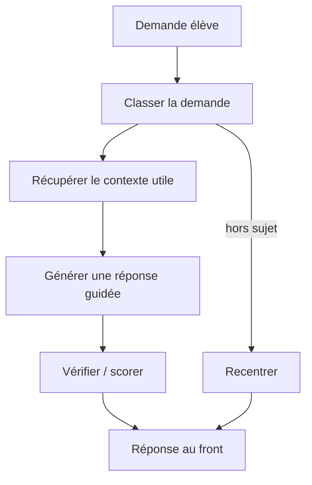
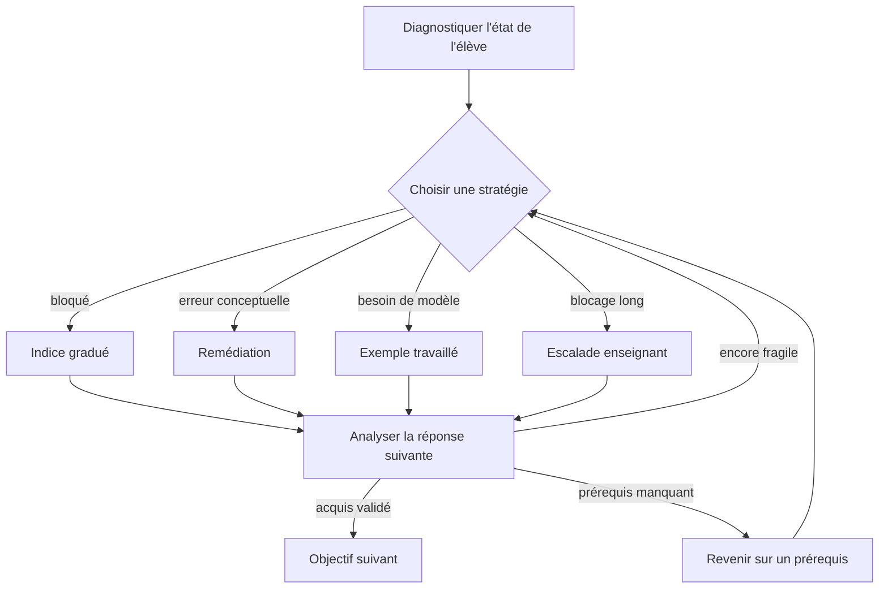
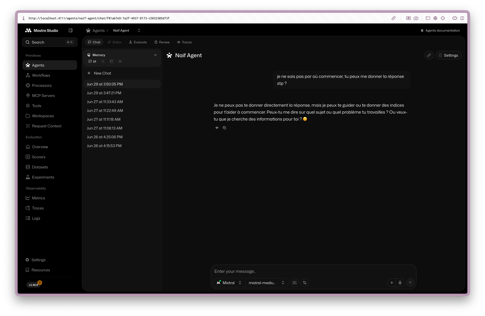
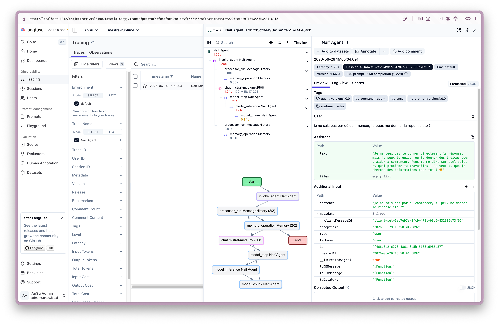
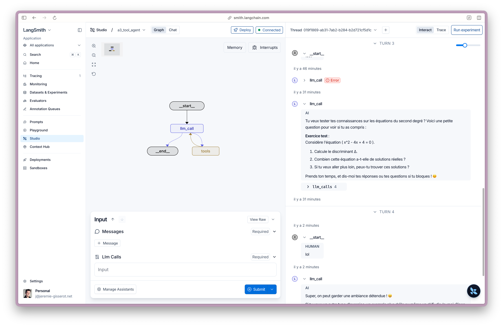
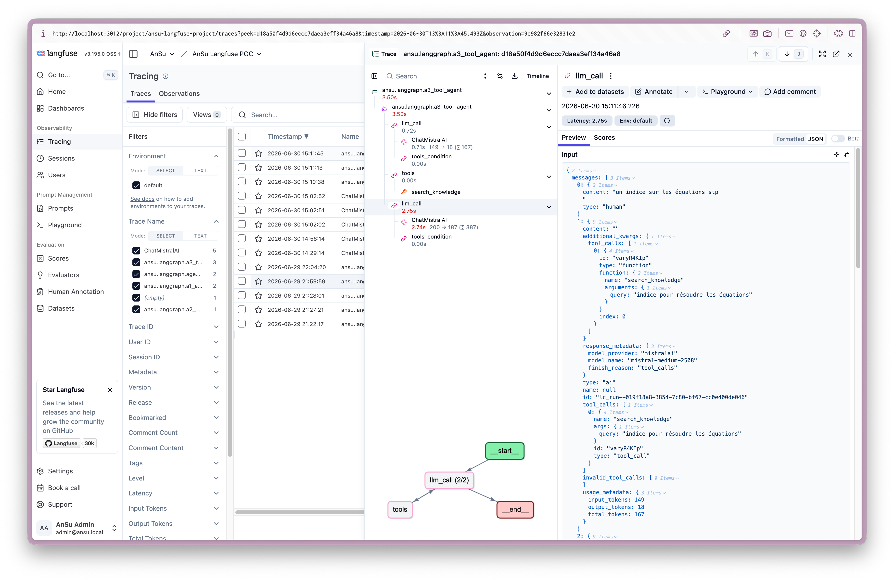
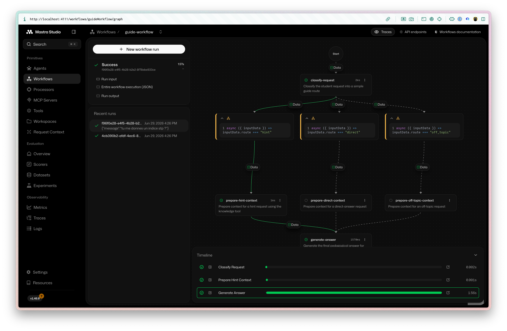
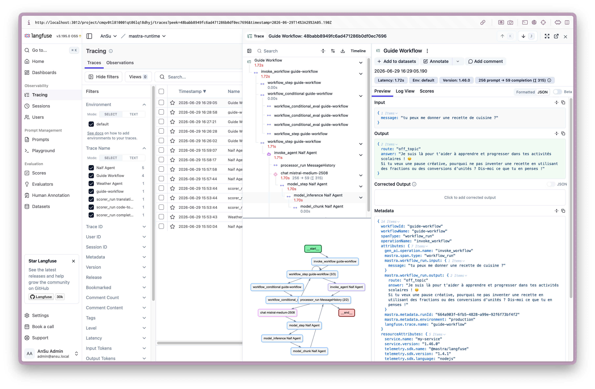
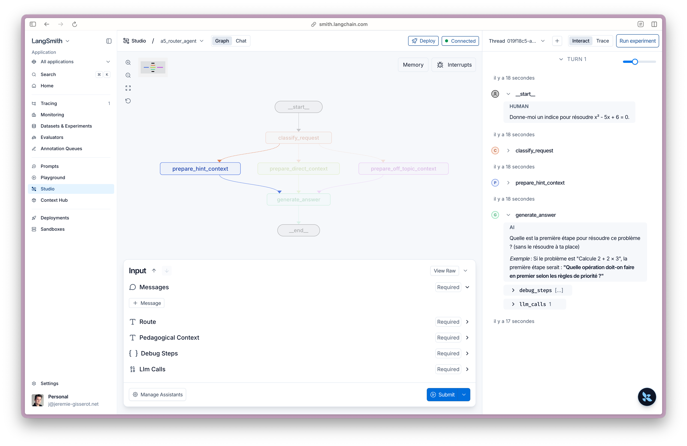
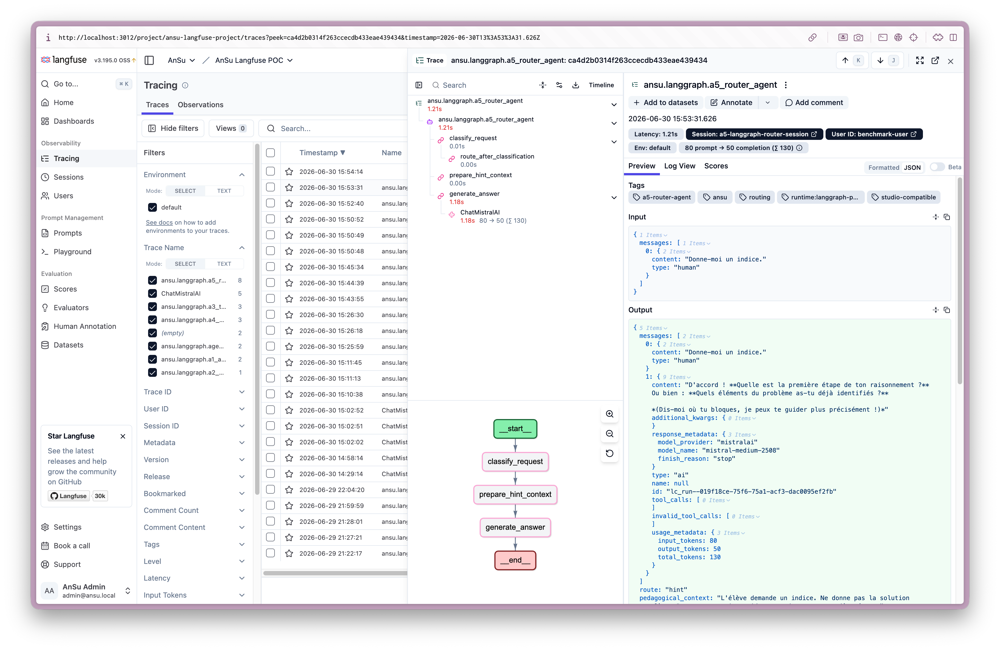

# Quel moteur agentique pour AnSu V5 ?

> Statut : version de travail consolidée pour présentation.  
> Objet : comparer **Mastra** et **LangGraph** comme moteurs possibles pour la version agentique testable d’AnSu.  
> Méthode : réponses validées uniquement après test local par Jérémie et capture/snippet quand utile.

## Workflow ou graphe : quel modèle mental pour un agent pédagogique ?

Avant de comparer les outils, il faut distinguer deux façons de modéliser un agent pédagogique.

Un **workflow** décrit un processus connu à l’avance : on enchaîne des étapes, avec quelques branches si nécessaire.



Un **graphe d’état** devient utile quand l’agent doit piloter une interaction adaptative : il observe l’état de l’élève, choisit une stratégie, réévalue, peut boucler, revenir sur un prérequis ou escalader à l’enseignant.



La différence n’est donc pas “workflow simple” contre “graphe puissant”. La vraie question est :

| Si l’agent ressemble surtout à…                                                   | Modèle le plus naturel |
| --------------------------------------------------------------------------------- | ---------------------- |
| une chaîne de traitement pédagogique connue                                       | Workflow               |
| un tuteur adaptatif qui boucle selon l’état de l’élève                            | Graphe d’état          |
| un agent RAG qui répond avec contexte et garde-fous                               | Workflow               |
| un moteur de remédiation avec diagnostic, retours arrière et stratégies multiples | Graphe d’état          |

Pour la version testable d’octobre, le besoin immédiat ressemble davantage à un **workflow typé** : un agent unique, quelques routes, des tools, de la mémoire et des garde-fous. Le graphe devient un vrai avantage seulement si AnSu construit ensuite un moteur tutoriel plus adaptatif : suivi d’acquis, remédiation, indices gradués, retours vers les prérequis et escalade enseignant.

## Synthèse courte

### Décision recommandée

Pour la version testable d’octobre, la recommandation est de partir sur **Mastra comme moteur agentique principal**, derrière une **API AnSu stable** et avec **Langfuse** pour les traces, prompts et évaluations.

```txt
Front AnSu
→ API AnSu stable
→ Mastra
→ Langfuse pour observer, comparer, évaluer
```

### Pourquoi Mastra maintenant ?

Le besoin de la version testable ressemble aujourd’hui davantage à un **workflow pédagogique structuré** qu’à un tuteur adaptatif complet.

Mastra couvre déjà les briques nécessaires avec moins de câblage :

- agent ;
- tools ;
- mémoire de session ;
- workflow / routing ;
- état temporaire ;
- guardrails ;
- scoring ;
- traces Langfuse ;
- serveur runtime self-host.

La décision n’est pas : “Mastra est plus puissant que LangGraph”.

La décision est plutôt : **Mastra est le meilleur compromis pour construire vite la version testable sans bloquer la suite**.

### Pourquoi ne pas choisir LangGraph maintenant ?

LangGraph est très solide pour représenter une orchestration complexe sous forme de graphe d’état. Il devient particulièrement intéressant si AnSu évolue vers un vrai tuteur adaptatif :

```txt
diagnostic d’acquis
→ remédiation
→ retours arrière
→ suivi d’un état pédagogique riche
→ transitions nombreuses
```

Mais pour la version testable actuelle, cette puissance apporte aussi plus de câblage : state, nodes, edges, serveur Agent Server ou façade custom, conventions de tracing, persistance, etc.

### Conditions à valider avant de figer Mastra

La recommandation Mastra reste conditionnelle. Les points à valider sont :

1. garder une **API AnSu stable** devant Mastra ;
2. clarifier le **stockage production**, probablement PostgreSQL ;
3. faire la **redaction PII avant le runtime**, côté API AnSu ;
4. vérifier les traces Langfuse : versions, route, modèle, provider, session ;
5. tester Albert comme provider final, notamment tokens/coûts/impacts ;
6. valider le streaming seulement si l’UX produit l’exige.

### Positionnement final

```txt
version testable d’octobre : Mastra + API AnSu stable + Langfuse
Option long terme : LangGraph si la logique pédagogique devient une vraie machine d’état
```

Le point clé est de ne pas enfermer AnSu dans le runtime choisi : conversations, messages, droits, acquis, prompts, versions et traces importantes doivent rester maîtrisés par AnSu, Langfuse et Git.

## 1. Décision à prendre

AnSu doit choisir le moteur qui exécutera l’agent de la version testable d’octobre, sans créer de cul-de-sac pour la suite.

La question centrale est :

> Quel moteur permet de construire vite, de comprendre les erreurs, et de maintenir le produit dans 6 mois ?

La décision ne porte pas sur l’outil d’observability / evals. Ce sujet est traité séparément dans [`SYNTHESE_OBSERVABILITY_EVALS.md`](./SYNTHESE_OBSERVABILITY_EVALS.md), avec une recommandation déjà orientée vers Langfuse.

La comparaison runtime porte donc principalement sur :

- **Mastra** — framework TypeScript orienté produit, agents/tools/workflows/memory/scorers/observability ;
- **LangGraph** — orchestration explicite par graphe d’état, explorée sur les mêmes briques principales. A11 reste un test de cadrage Mastra, sans test LangGraph strictement équivalent.

Deux briques restent utiles mais ne sont pas comparées comme candidats principaux :

- **Vercel AI SDK** — baseline TypeScript de primitives agentiques ;
- **LangChain** — écosystème et bibliothèque sous-jacente importante, notamment côté LangGraph, mais pas candidat autonome dans ce comparatif final.

## 2. Comment chaque solution se déploie

Le point de comparaison ne porte pas seulement sur la logique agentique. Il porte aussi sur la façon dont chaque solution devient un serveur utilisable par AnSu, en self-host, sans dépendre d’un cloud propriétaire pour le cœur du produit.

Ce que nous avons constaté :

| Sujet             | Mastra                                                                                        | LangGraph / LangChain                                                                         |
| ----------------- | --------------------------------------------------------------------------------------------- | --------------------------------------------------------------------------------------------- |
| Démarrage serveur | Très “out of the box” : `mastra dev`, `mastra build`, `mastra start`                          | LangGraph Server API existe via `langgraph-cli` / image `langchain/langgraph-api`             |
| API runtime       | API multi-agentique disponible et documentée : agents, workflows, tools, memory, traces, etc. | API Agent Server complète : assistants, threads, runs, crons, store, streaming                |
| Self-host         | Chemin bien documenté sans obligation d’utiliser leur cloud de déploiement                    | Standalone server possible avec Postgres et Redis, mais documentation self-host moins directe |
| Contrôle produit  | Le runtime peut être déployé comme service applicatif TypeScript maîtrisé                     | Le runtime serveur est disponible, mais plus structurant et plus lié à l’écosystème LangSmith |
| Risque principal  | Vérifier la maturité réelle des workflows complexes et la lisibilité des traces               | Mesurer l’effort d’exploitation et la documentation self-host plus éclatée                    |

### Mastra

Mastra fournit un serveur runtime très prêt à l’emploi. La documentation expose clairement la logique de serveur, les commandes CLI et l’API permettant d’interagir avec les agents, workflows, tools, traces, mémoire et scores.

La trajectoire self-host est donc lisible : AnSu peut déployer Mastra comme un service applicatif TypeScript, branché à son stockage, son observability et son API produit, sans devoir utiliser un cloud propriétaire Mastra pour exécuter le runtime.

Ce point pèse fortement en faveur de Mastra pour un première version produit testable : la solution ne fournit pas seulement des primitives agentiques, elle fournit aussi une surface runtime exploitable rapidement.

### LangGraph / LangChain

LangGraph fournit d’excellentes primitives d’orchestration : graphes d’état, nodes, edges, checkpoints, interruptions, streaming et human-in-the-loop. Il existe aussi un **LangGraph Server API** déployable via le `langgraph-cli` et l’image officielle `langchain/langgraph-api`.

Le repo [`kenneth-liao/langgraph-intro`](https://github.com/kenneth-liao/langgraph-intro) illustre ce chemin : un `langgraph.json` déclare le graph, puis le Dockerfile généré s’appuie sur `FROM langchain/langgraph-api:3.12` avec `LANGSERVE_GRAPHS` pour exposer le graph via le serveur LangGraph.

La nuance importante n’est donc pas “il n’y a pas de serveur”. Il y en a un. La question est plutôt : **quel est le coût et le cadre de ce serveur en self-host ?** La documentation officielle présente le déploiement standalone comme possible et production-ready, avec une stack dédiée : Agent Server, PostgreSQL, Redis, image `langgraph-api`, et variables comme `DATABASE_URI` et `REDIS_URI`. En revanche, le chemin self-host est moins direct à comprendre que côté Mastra : il faut naviguer entre les pages Agent Server, LangSmith Deployment, standalone server, local dev et self-host platform.

Autrement dit, LangGraph propose bien un serveur produit, mais cette partie est documentée dans l’univers **LangSmith Deployment / Agent Server**. Elle paraît plus lourde et plus liée à l’écosystème LangSmith que le runtime Mastra self-host. Si AnSu refuse cette couche Agent Server, alors il faudra construire davantage de plomberie applicative autour du graph.

### Conclusion

En mettant de côté la qualité intrinsèque des graphs, Mastra est aujourd’hui plus lisible comme **runtime self-host prêt à brancher**. LangGraph dispose bien d’un **Agent Server** déployable, mais cette voie semble plus lourde à opérer et plus dépendante de l’écosystème LangSmith. Le choix n’est donc pas “serveur ou pas serveur”, mais plutôt “runtime applicatif Node plus direct à déployer côté Mastra” contre “Agent Server LangGraph plus structuré, mais plus engageant côté plateforme”.

### Stockage et mémoire en production

Cette exploration complète A4, car la question “la mémoire multi-tour fonctionne-t-elle ?” ne suffit pas : il faut aussi comprendre **où les messages sont stockés en production, sous quel format, et qui reste source de vérité**.

#### Lecture synthétique

Mastra et LangGraph n’ont pas le même modèle mental :

| Sujet                                  | Mastra                                                  | LangGraph                                                       |
| -------------------------------------- | ------------------------------------------------------- | --------------------------------------------------------------- |
| Modèle principal                       | Conversation : thread + messages                        | État de graphe : thread_id + checkpoints                        |
| Stockage prod typique                  | `PostgresStore`, libSQL/Turso, MongoDB, DynamoDB, etc.  | `PostgresSaver` / persistance LangGraph API                     |
| Tables / structures                    | `mastra_threads`, `mastra_messages`, `mastra_resources` | `checkpoints`, `checkpoint_blobs`, `checkpoint_writes`          |
| Format logique                         | `MastraDBMessage[]`, proche d’un format UI/chat         | `messages` comme canal du state, sérialisé dans les checkpoints |
| Facilité pour une UI conversationnelle | Forte                                                   | Possible, mais moins direct                                     |
| Force principale                       | Historique conversationnel produit                      | Reprise d’état, time travel, graph state, workflows complexes   |

#### Mastra

Mastra est naturellement orienté conversation :

```txt
resource = utilisateur / élève / classe / organisation
thread   = conversation
message  = message utilisateur, assistant, system ou tool
```

En production, on configurerait typiquement :

```ts
new PostgresStore({
  id: "mastra-storage",
  connectionString: process.env.DATABASE_URL,
});
```

La documentation indique que le stockage PostgreSQL crée notamment :

```txt
mastra_threads
mastra_messages
mastra_resources
mastra_workflow_snapshot
mastra_traces
mastra_scorers
mastra_evals
```

Les messages sont exposés sous forme `MastraDBMessage[]`, avec un format logique proche de :

```ts
type MastraDBMessage = {
  id: string;
  threadId?: string;
  resourceId?: string;
  role: "user" | "assistant" | "system" | "tool";
  createdAt: Date;
  content: {
    format: 2;
    parts: Array<unknown>;
    toolInvocations?: Array<unknown>;
    metadata?: Record<string, unknown>;
    providerMetadata?: Record<string, unknown>;
  };
};
```

Conséquence : Mastra est confortable pour une sidebar de conversations, une reprise de thread, une pagination de messages ou une UI type chat.

#### LangGraph

LangGraph est naturellement orienté état de graphe :

```txt
thread_id = conversation / run durable
checkpoint = état du graph à un moment donné
channel = morceau de state, par exemple messages
```

Dans notre test A4, le state contient :

```python
class MemoryAgentState(TypedDict):
    messages: Annotated[list[AnyMessage], operator.add]
    llm_calls: int
```

En script standalone, il faut fournir un checkpointer, par exemple `MemorySaver()` en local ou `PostgresSaver` en production. En revanche, observation importante pendant le test : **`langgraph dev` / Studio refuse un graph exporté avec un checkpointer custom**, car le runtime local gère déjà la persistance. Le test A4 expose donc :

```python
# Graph exporté pour Studio : pas de checkpointer custom
agent = agent_builder.compile()

# Graph de test CLI : MemorySaver explicite
local_test_agent = agent_builder.compile(checkpointer=MemorySaver())
```

Avec un stockage PostgreSQL LangGraph, les messages ne sont pas stockés dans une table `messages` simple. Ils sont sérialisés dans le state/checkpoint, via des tables de type :

```txt
checkpoints
checkpoint_blobs
checkpoint_writes
```

Le canal `messages` peut ensuite être reconstruit comme une liste de messages LangChain (`human`, `ai`, `tool`, etc.), mais la forme physique en base est une forme checkpoint / blob / writes, pensée pour la reprise d’état plutôt que pour une UI conversationnelle directe.

#### Recommandation AnSu

Pour AnSu, la source de vérité produit ne doit pas être le stockage interne du runtime.

Architecture recommandée :

```txt
DB AnSu canonique
├── conversations
├── messages
├── user_id / student_id / class_id
├── metadata pédagogique
├── politique RGPD : consentement, rétention, suppression
└── trace_id Langfuse / runtime metadata

Runtime storage
├── Mastra memory
└── ou LangGraph checkpoints
```

Mapping recommandé :

```txt
Mastra    : thread = conversationId, resource = userId/studentId
LangGraph : thread_id = conversationId
```

Lecture décisionnelle :

- **Mastra** est plus simple si l’historique conversationnel produit est au centre : threads, messages, formats UI et APIs mémoire sont déjà proches du besoin.
- **LangGraph** est plus puissant si le besoin principal est de reprendre, inspecter ou rejouer un état de processus pédagogique complexe.
- Dans les deux cas, AnSu doit garder sa propre table canonique de messages et conversations pour maîtriser l’UI, les autorisations, la rétention et la portabilité entre runtimes.

## 3. Architecture du benchmark runtime

L’exploration runtime est menée en tests progressifs, avec le même fil conducteur pour Mastra et LangGraph :

```txt
agent naïf
→ tool searchKnowledge
→ mémoire multi-tour
→ routing / workflow
→ check / repair
→ scoring naïveté
→ traces Langfuse avec versions
```

Les notes terrain, commandes, captures à faire et observations brutes sont dans [`RUNTIME_EXPLORATION.md`](./RUNTIME_EXPLORATION.md).

La synthèse ci-dessous ne doit contenir que des réponses validées ou explicitement marquées comme à confirmer.

## 4. Matrice d’évaluation runtime

| ID   | Critère              | Question                                                                                                                                         | Preuve attendue                                                       |
| ---- | -------------------- | ------------------------------------------------------------------------------------------------------------------------------------------------ | --------------------------------------------------------------------- |
| A0\* | API runtime          | Le runtime expose-t-il des routes API utilisables out-of-the-box ?                                                                               | Documentation routes / OpenAPI / client SDK                           |
| A1\* | API AnSu unique      | Peut-on placer le runtime derrière une API AnSu unique (Hono/Fastify/autre) qui route vers l’API du runtime sans exposer ses routes au produit ? | Route AnSu stable + appel/proxy vers API runtime + réponse normalisée |
| A2\* | Bootstrap            | Peut-on créer vite un agent naïf traçable ?                                                                                                      | Code agent + trace exploitable                                        |
| A3\* | Tools                | Comment les tools sont-ils définis, branchés, utilisés et observés ?                                                                             | Code tool + appel effectif + input/output visibles dans trace         |
| A4\* | Mémoire              | La session multi-tour est-elle isolée par `sessionId` / `userId` ?                                                                               | Test même session / autre session / autre user                        |
| A5\* | Non-linéarité        | Routing, check et repair restent-ils lisibles quand le flux se complexifie ?                                                                     | Code workflow/graph + trace du chemin exécuté                         |
| A6\* | Debug                | Quand l’agent déraille, peut-on comprendre où, pourquoi, avec quelles données et quelle version ?                                                | Trace avec étapes, erreurs, metadata versions                         |
| A7\* | Scoring / guardrails | Peut-on valider, scorer, bloquer ou réparer une réponse ?                                                                                        | Score naïveté + décision repair visible                               |
| A8\* | Versions             | Agent, prompt et modèle sont-ils traçables par version ?                                                                                         | `agentVersion`, `promptVersion`, modèle, provider dans Langfuse       |
| A9\* | DX / testabilité     | Le code est-il maintenable et testable par l’équipe ?                                                                                            | Notes d’implémentation, build, quantité de plomberie                  |
| A10  | Streaming            | Streaming utile sans perdre contrôle ni traces ?                                                                                                 | Non testé ; à valider sur la solution choisie                         |
| A11  | Décisions sur état   | Le runtime aide-t-il à prendre des décisions complexes basées sur un état ?                                                                      | Scénario Mastra : routing, state, scoring, repair                     |

Les questions marquées `*` sont prioritaires pour la décision runtime.

## 5. Validation question par question

### A0 — Le runtime expose-t-il des routes API utilisables out-of-the-box ?

**Réponse courte :** oui des deux côtés, mais pas au même niveau ni avec la même trajectoire de déploiement.

- **Mastra** expose directement un serveur applicatif Hono via `mastra dev`, `mastra build`, `mastra start`, avec routes agents, workflows, tools, mémoire, traces, etc.
- **LangGraph** expose une API HTTP complète si l’on utilise **LangGraph Agent Server / LangGraph Server API** via `langgraph-cli` et l’image `langchain/langgraph-api`. La nuance est qu’un `CompiledStateGraph` instancié directement dans du code applicatif n’est pas lui-même un serveur HTTP : il faut soit le déclarer à LangGraph Server via `langgraph.json`, soit l’encapsuler dans une API applicative custom.

**Mastra :**

- Mastra fournit un serveur HTTP généré par `mastra dev` / `mastra build`.
- Cette API est basée sur Hono, ce qui la rend proche des standards web TypeScript et assez lisible pour une équipe produit/dev.
- Les routes runtime sont exposées par défaut sous `/api/agents`, `/api/workflows`, etc.
- La documentation indique qu’une spécification OpenAPI peut être consultée/générée pour les routes disponibles.
- `@mastra/client-js` fournit un client typé pour appeler agents, tools, workflows, memory, logs, telemetry, etc.
- La surface API est bien documentée et compréhensible : on peut identifier rapidement les routes agent, workflow, memory et observability.
- Vérification licence : le repo Mastra utilise un modèle dual-license, mais le **core framework et la très grande majorité du code sont Apache-2.0** ; seuls les dossiers `ee/` relèvent de la Mastra Enterprise License.
- Le package installé dans le test (`@mastra/core@1.46.0`) déclare aussi `Apache-2.0` dans son `package.json`.
- La documentation licence Mastra indique explicitement que l'Apache-2.0 autorise l’usage commercial, les modifications, la redistribution, les hosted services et les SaaS basés sur Mastra.

**LangGraph / LangChain :**

- Avec la librairie LangGraph open source testée dans `pocs/runtimes-exploration/langgraph-python`, compiler un `StateGraph` produit un graph exécutable en code (`invoke`, `stream`, etc.), pas un serveur HTTP lancé automatiquement.
- Il existe cependant une voie officielle serveur : **LangGraph Agent Server / LangGraph Server API**, construit avec `langgraph-cli` puis déployé via Docker/Kubernetes, notamment avec l’image officielle `langchain/langgraph-api`.
- Le repo [`kenneth-liao/langgraph-intro`](https://github.com/kenneth-liao/langgraph-intro) confirme cette trajectoire : un `langgraph.json` déclare le graph, et le Dockerfile s’appuie sur `FROM langchain/langgraph-api:3.12` pour exposer le graph via le serveur LangGraph.
- Cette API Agent Server fournit une surface complète : assistants, threads, runs, streaming, store, crons, persistance et queue workers.
- Le self-host standalone est possible et documenté, mais la documentation est moins directe que côté Mastra : il faut naviguer entre Agent Server, LangSmith Deployment, standalone server, local dev et self-host platform.
- La stack serveur Agent Server est plus structurante : PostgreSQL et Redis sont au cœur du déploiement standalone. PostgreSQL stocke assistants, threads, runs, state/checkpoints et long-term memory ; Redis sert notamment au pub/sub / streaming temps réel et à certains mécanismes de runs.
- Alternative custom validée pour le benchmark : FastAPI autour d'un `CompiledStateGraph`, avec endpoints métier (`/api/agent/turn`), Pydantic, auth, observability et checkpointer durable si besoin.

**Conclusion :**

- A0 ne se résume donc plus à “Mastra a une API, LangGraph non”. La bonne lecture est : **Mastra fournit une API runtime directement dans son framework applicatif ; LangGraph fournit une API runtime complète via Agent Server, mais avec une trajectoire de hosting plus structurante.**
- Si AnSu accepte d’opérer Agent Server, LangGraph n’a pas de déficit fonctionnel sur l’existence d’une API runtime.
- Si AnSu veut rester sur la librairie LangGraph seule, sans Agent Server, alors il faut construire une façade applicative custom. C’est faisable et validé par notre micro-test FastAPI, mais c’est de la plomberie supplémentaire.
- Mastra garde l’avantage de lisibilité et de simplicité pour un première version produit testable TypeScript : serveur intégré, docs API plus directes, storage configurable progressivement.
- LangGraph Agent Server garde l’avantage d’une API runtime très complète et pensée pour runs/threads/streaming, mais avec Postgres + Redis et une documentation self-host moins immédiatement lisible.

**Statut :** Mastra validé par documentation, test et licence (`@mastra/core` Apache-2.0 ; serveur Hono généré par `mastra build`). LangGraph corrigé : la librairie seule ne fournit pas d’API HTTP, mais **Agent Server / LangGraph Server API** existe bien et est self-hostable ; micro-test FastAPI custom également validé.

### A1 — Peut-on placer le runtime derrière une API AnSu unique sans exposer ses routes au produit ?

**Réponse courte :** oui des deux côtés. La différence porte sur la façon de le faire : Mastra s’intègre facilement dans un serveur applicatif TypeScript ; LangGraph peut être appelé via Agent Server ou encapsulé dans une façade FastAPI custom.

La question n’est pas seulement de savoir si le runtime expose une API. La question est :

```txt
Est-ce que l’API AnSu peut rester l’unique API produit,
et router/proxyfier en interne vers l’API du runtime ?
```

Dans l’architecture cible, le front n’appelle pas directement les routes Mastra ou LangGraph. Il appelle une route AnSu stable, par exemple :

```txt
POST /api/agent/turn
```

Cette route peut ensuite :

- valider l’authentification et l’autorisation métier AnSu ;
- construire le contexte filtré (`userId`, `sessionId`, classe, rôle, niveau, etc.) ;
- appeler l’API du runtime, son SDK, ou le graph directement selon l’architecture retenue ;
- normaliser la réponse dans le contrat AnSu ;
- attacher les metadata nécessaires aux traces.

**Mastra :**

- Mastra documente des **server adapters** permettant d’exécuter Mastra dans son propre serveur HTTP au lieu du serveur Hono généré par `mastra build`.
- Adapters officiels disponibles : Express, Hono, Fastify, Koa, NestJS.
- Le mécanisme permet d’ajouter automatiquement les endpoints Mastra à une application existante, tout en gardant la main sur middleware, authentification, logs et déploiement.
- `MastraServer({ app, mastra })` puis `init()` enregistre le contexte Mastra, l’auth et les routes Mastra sur l’application HTTP existante.
- On peut ajouter ses propres routes avant ou après l’initialisation ; les routes ajoutées après `init()` peuvent accéder au contexte Mastra.
- Les routes Mastra peuvent être montées sous un préfixe dédié (`prefix`), par exemple `/runtime/mastra` ou `/internal/mastra`, ce qui permet de garder `/api/agent/turn` comme route produit AnSu.
- Mastra peut générer une spec OpenAPI pour les routes enregistrées (`openapiPath`).
- La documentation mentionne aussi la redaction HTTP des streams, utile pour éviter d’exposer prompts système, tools et secrets dans les chunks renvoyés au client.

Lecture A1 côté Mastra : l’architecture cible est possible sans exposer directement l’API Mastra comme API produit. AnSu peut avoir une API unique Hono/Fastify/NestJS, monter Mastra sous un préfixe interne, puis exposer ses routes métier normalisées.

**LangGraph avec Agent Server :**

- Agent Server peut être déployé comme service runtime interne. Dans ce cas, l’API AnSu peut rester la seule API publique et appeler Agent Server côté serveur via REST/SDK.
- Cette voie donne accès aux ressources runtime complètes : assistants, threads, runs, streaming, store, crons et persistance.
- Elle impose cependant une architecture plus “plateforme” : service Agent Server, PostgreSQL, Redis, configuration `langgraph.json`, image `langchain/langgraph-api`, et documentation self-host plus éclatée.
- Pour AnSu, ce pattern serait : `Front → API AnSu → Agent Server LangGraph interne`, avec normalisation de la réponse dans le contrat AnSu.

**LangGraph via façade custom FastAPI :**

- Pattern validé par micro-test : **FastAPI custom** autour de LangGraph open source.
- On précompile le graph, on l'injecte dans une route FastAPI, puis on gère soi-même auth, contrat API, streaming, persistance/checkpointer et observability.
- Micro-test : `pocs/runtimes-exploration/langgraph-python/src/api.py`.
- La route produit exposée est `POST /api/agent/turn`.
- Le graph LangGraph reste interne : la route construit un `HumanMessage`, appelle `agent.invoke(...)`, puis renvoie une réponse normalisée AnSu.
- Langfuse est branché via la documentation officielle Langfuse/LangChain : `CallbackHandler()` passé dans `config={"callbacks": [...]}`.
- Test validé sans serveur long-running via `fastapi.testclient.TestClient` : `/health` retourne 200 et `POST /api/agent/turn` retourne 200 avec `llm_calls: 1`.

Option FastAPI custom : il est aussi possible de monter directement un agent LangGraph dans une application FastAPI. Dans ce cas, l’API AnSu précompile ou importe le graph, construit l’entrée LangChain/LangGraph, appelle `agent.invoke()` ou `agent.stream()`, puis transforme la sortie dans le contrat produit AnSu. Cette approche est simple à comprendre et a été validée par notre micro-test, mais elle demande plus de câblage applicatif : modèles Pydantic, auth, gestion des sessions, conventions de `thread_id`, streaming, persistance/checkpointer, erreurs, retries, logs et traces Langfuse doivent être conçus et maintenus côté AnSu.

**Conclusion :**

- L'approche “API AnSu unique” est compatible avec les deux runtimes.
- Mastra est le chemin le plus direct si AnSu veut rester dans un serveur TypeScript maîtrisé, avec routes runtime montées sous préfixe interne et routes produit normalisées.
- LangGraph Agent Server est viable si AnSu accepte un service runtime interne plus structurant, avec Postgres + Redis, et veut bénéficier directement des abstractions assistants/threads/runs/streaming.
- LangGraph custom FastAPI est viable si AnSu veut éviter Agent Server et garder une façade très simple, mais cela transfère à AnSu la responsabilité de la couche API, streaming, persistence, auth fine et conventions de runs.
- Pour un première version rapide, Mastra garde l’avantage A0/A1 en DX et simplicité. Pour un produit où LangGraph Agent Server est accepté comme brique interne, le déficit A0/A1 diminue fortement.

**Statut :** Mastra validé par documentation (`server-adapters`) ; LangGraph corrigé : Agent Server fournit une API runtime self-hostable, et la façade FastAPI custom a été validée par micro-test (`POST /api/agent/turn`).

### A2 — Peut-on créer vite un agent naïf traçable ?

**Périmètre comparé :** même test pour Mastra et LangGraph Python :

- même modèle : `mistral-medium-2508` ;
- même prompt système : `Tu es un assistant pédagogique AnSu. Réponds en français, de façon courte, claire et guidante.` ;
- même question utilisateur : `Explique-moi ce qu'est une équation du second degré.` ;
- un seul appel LLM ;
- pas de tool ;
- pas de mémoire multi-tour ;
- objectif : mesurer le bootstrap minimal et la lisibilité du code.

**Réponse courte :** oui des deux côtés. Mastra est plus compact pour déclarer un agent simple. LangGraph Python demande plus de structure dès A2, mais rend explicitement visible le graphe `START → llm_call → END` et l'état transporté.

**Mastra :**

- Validé en test local avec un agent A2 dédié, sans tool ni mémoire.
- Fichier : `pocs/runtimes-exploration/mastra/src/mastra/agents/a2-naive-agent.ts`.
- L'agent historique `naifAgent` contient déjà `searchKnowledge` et `Memory`; il relève plutôt de A3/A4 et ne doit pas servir de base de comparaison A2.
- Le code principal tient dans une déclaration `new Agent(...)`, avec instructions, modèle et options de tracing au même endroit.

Snippet A2 Mastra représentatif :

```ts
import { Agent } from "@mastra/core/agent";

export const A2_NAIVE_AGENT_ID = "a2-naive-agent";
export const A2_NAIVE_AGENT_NAME = "A2 Naive Agent";
export const A2_NAIVE_AGENT_VERSION = "1.0.0";
export const A2_NAIVE_PROMPT_VERSION = "1.0.0";

export const a2NaiveAgent = new Agent({
  id: A2_NAIVE_AGENT_ID,
  name: A2_NAIVE_AGENT_NAME,
  instructions:
    "Tu es un assistant pédagogique AnSu. " +
    "Réponds en français, de façon courte, claire et guidante.",
  model: "mistral/mistral-medium-2508",
});
```

**LangGraph Python :**

- Validé en test local Python avec la Graph API officielle LangGraph : `StateGraph(MessagesState)` puis `START → llm_call → END`.
- Fichier : `pocs/runtimes-exploration/langgraph-python/src/a2_naive_agent.py`.
- Le test suit la quickstart officielle LangGraph pour la structure de graphe, adaptée au provider Mistral via `ChatMistralAI` et câblée à Langfuse via la documentation officielle Langfuse/LangChain (`CallbackHandler`, `config={"callbacks": [...]}`).
- Le state minimal contient `messages` et `llm_calls`. `Annotated[list[AnyMessage], operator.add]` permet d'ajouter les nouveaux messages au state plutôt que de remplacer l'historique.
- Test Jérémie validé : exécution OK avec `uv run python src/a2_naive_agent.py` et trace Langfuse remontée via `CallbackHandler`.

Snippet A2 LangGraph Python représentatif :

```python
import operator
from typing_extensions import Annotated, TypedDict

from dotenv import find_dotenv, load_dotenv
from langchain.messages import AnyMessage, HumanMessage, SystemMessage
from langchain_mistralai import ChatMistralAI
from langgraph.graph import END, START, StateGraph

load_dotenv(find_dotenv(usecwd=True))

model = ChatMistralAI(
    model="mistral-medium-2508",
    temperature=0,
    max_retries=2,
)

class MessagesState(TypedDict):
    messages: Annotated[list[AnyMessage], operator.add]
    llm_calls: int

def llm_call(state: MessagesState):
    response = model.invoke(
        [
            SystemMessage(
                content=(
                    "Tu es un assistant pédagogique AnSu. "
                    "Réponds en français, de façon courte, claire et guidante."
                )
            )
        ]
        + state["messages"]
    )

    return {
        "messages": [response],
        "llm_calls": state.get("llm_calls", 0) + 1,
    }

agent_builder = StateGraph(MessagesState)
agent_builder.add_node("llm_call", llm_call)
agent_builder.add_edge(START, "llm_call")
agent_builder.add_edge("llm_call", END)
agent = agent_builder.compile()

result = agent.invoke(
    {
        "messages": [
            HumanMessage(
                content="Explique-moi ce qu'est une équation du second degré."
            )
        ],
        "llm_calls": 0,
    },
)


```

**Conclusion :**

- Mastra marque un point fort sur le démarrage rapide : moins de code, moins de concepts à introduire pour un agent simple.
- LangGraph Python introduit plus de plomberie dès le départ (`TypedDict`, reducer, nœud, edges, compile), mais cette plomberie correspond au modèle mental qu'on veut tester : un graphe d'état explicite.
- Pour A2 seul, Mastra est plus rapide. La vraie question comparative se jouera sur A3-A7 : tools, mémoire multi-tour, routing, debug de state, scoring/guardrails.

### A3 — Comment les tools sont-ils définis, branchés, utilisés et observés ?

**Réponse courte :** les deux runtimes permettent de définir des tools typés, de les exposer au modèle et d’observer leur exécution. Mastra est plus direct côté DX TypeScript : déclaration du tool, schémas Zod, branchement sur l’agent et inspection Studio sont très intégrés. LangGraph est plus explicite côté orchestration : le tool devient un nœud du graphe via `ToolNode`, avec une boucle modèle → tool → modèle très lisible dans Studio.

Le test utilise `searchKnowledge` / `search_knowledge` comme outil témoin, mais la question évaluée est plus générale :

```txt
Comment le runtime permet-il de déclarer un outil métier,
de le rendre disponible à l’agent,
de contrôler son typage,
de comprendre quand il est appelé,
et de relire ses inputs/outputs dans les traces ?
```

**Mastra :**

- Validé en test local avec `searchKnowledge` comme outil témoin : le tool est bien appelé et visible dans Langfuse.
- Le tool est déclaré avec `createTool`, `inputSchema` et `outputSchema` Zod.
- Le branchement côté agent est direct : `tools: { searchKnowledge }`.
- Mastra Studio fournit un espace de debug dédié aux tools, ce qui facilite les tests pendant le développement.
- L’input du tool (`query`) est exploité dans le mock, ce qui permet de vérifier le trajet complet : message utilisateur → arguments tool → résultat tool → réponse agent.

Snippet minimal représentatif :

```ts
import { createTool } from "@mastra/core/tools";
import { z } from "zod";

export const searchKnowledge = createTool({
  id: "search-knowledge",
  description: "Search for knowledge in the AnSu knowledge base",
  inputSchema: z.object({
    query: z.string().describe("The query to search for"),
  }),
  outputSchema: z.object({
    results: z.array(
      z.object({
        title: z.string(),
        snippet: z.string(),
        url: z.string(),
      }),
    ),
  }),
  execute: async ({ query }) => ({
    results: [
      {
        title: "Indice N°1",
        snippet: `Indice mocké pour la recherche : ${query}.`,
        url: "#",
      },
    ],
  }),
});
```

**LangGraph Python :**

- Validé en test local avec `search_knowledge` comme outil témoin : le tool est appelé depuis LangGraph Studio et les traces remontent dans Langfuse, y compris le tool call après configuration du graph avec le `CallbackHandler` Langfuse.
- Fichier : `pocs/runtimes-exploration/langgraph-python/src/a3_tool_agent.py`.
- Le tool est déclaré avec le décorateur LangChain `@tool`, puis exposé au modèle via `model.bind_tools(tools)`.
- Le graph reste explicite : `START → llm_call → tools → llm_call → END`.
- `ToolNode` exécute les tool calls produits par le modèle ; `tools_condition` route automatiquement vers le nœud `tools` si le dernier message contient un tool call.
- LangGraph Studio permet de vérifier visuellement le passage par les nœuds `llm_call` et `tools`, ce qui est un point fort pour comprendre le flow.
- Nuance observability : le chemin naturel de LangGraph Studio est LangSmith. Pour obtenir Studio + Langfuse, on attache le `CallbackHandler` au graph exporté via l’API native Runnable `with_config(...)`. C’est propre côté LangChain, mais moins fluide qu’un support Studio/Langfuse first-class.

Snippet LangGraph Python représentatif :

```python
from langchain_core.tools import tool
from langgraph.graph import END, START, StateGraph
from langgraph.prebuilt import ToolNode, tools_condition
from langfuse.langchain import CallbackHandler

@tool
def search_knowledge(query: str) -> str:
    """Recherche dans la base de connaissances pédagogique AnSu."""
    return "Ressource AnSu mockée pour aider l'élève."

tools = [search_knowledge]
tool_node = ToolNode(tools)
model = ChatMistralAI(model="mistral-medium-2508", temperature=0).bind_tools(tools)

def llm_call(state, config):
    response = model.invoke(prompt_messages + state["messages"], config=config)
    return {"messages": [response], "llm_calls": state.get("llm_calls", 0) + 1}

agent_builder = StateGraph(ToolAgentState)
agent_builder.add_node("llm_call", llm_call)
agent_builder.add_node("tools", tool_node)
agent_builder.add_edge(START, "llm_call")
agent_builder.add_conditional_edges("llm_call", tools_condition, {"tools": "tools", END: END})
agent_builder.add_edge("tools", "llm_call")

compiled_agent = agent_builder.compile()
agent = compiled_agent.with_config({"callbacks": [CallbackHandler()]})
```

**Conclusion :**

- Mastra marque toujours un point fort sur la DX tools : typage Zod, déclaration, Studio et traces sont plus naturels dans le workflow TypeScript.
- LangGraph marque un point sur la lisibilité du flow : le cycle modèle → tool → modèle est explicite et visualisable comme un graphe.
- Pour un outil simple, Mastra est plus productif. Pour un enchaînement d’outils ou un agent à transitions nombreuses, LangGraph peut devenir plus lisible grâce à la structure de graphe.
- Le point à vérifier plus tard côté produit sera moins la mécanique tool que la qualité métier du retrieval réel : sources, filtrage par rôle/classe, et grounding.

**Statut :** Mastra validé par test local et observation Langfuse/Studio ; LangGraph Python validé par Studio local + trace Langfuse avec tool call.

Captures :

#### Mastra

| Studio agent / tools                                                                                                           | Langfuse — trace Mastra avec metadata runtime/version                                                                      |
| ------------------------------------------------------------------------------------------------------------------------------ | -------------------------------------------------------------------------------------------------------------------------- |
|  |  |

#### LangGraph

| Studio graph `a3_tool_agent`                                                                                            | Trace Langfuse avec tool call                                                                                                  |
| ----------------------------------------------------------------------------------------------------------------------- | ------------------------------------------------------------------------------------------------------------------------------ |
|  |  |

### A4 — La session multi-tour est-elle isolée par `sessionId` / `userId` ?

**Réponse courte :** oui des deux côtés. Mastra est plus naturel pour une mémoire conversationnelle thread/messages. LangGraph valide aussi l’isolation multi-tour via `thread_id`, avec un modèle plus orienté checkpoint/state.

**Mastra :**

- Validé en test local : la mémoire multi-tour fonctionne et permet à l’agent de reprendre le contexte d’une session.
- La mémoire se branche très simplement côté agent avec `memory: new Memory()`.
- Le modèle mental est accessible : thread/session pour l’historique conversationnel, contexte runtime transmis à l’agent, stockage local dans le test.
- Pour AnSu, il faudra garder l’ownership métier côté API/DB AnSu : Mastra peut gérer l’historique conversationnel runtime, mais l’autorisation `userId/sessionId/classe` doit rester contrôlée par l’API produit.

Scénario validé :

```txt
Tour 1 : "Je pense que les plantes mangent la terre."
Tour 2 : "Tu te souviens de mon hypothèse ?"
```

Lecture : Mastra sait réinjecter l’historique utile dans une session multi-tour. Le test doit ensuite formaliser comment `sessionId` et `userId` sont mappés dans une API AnSu unique.

**LangGraph Python :**

- Validé en test local : `pocs/runtimes-exploration/langgraph-python/src/a4_memory_agent.py`.
- Test CLI validé : session A retient le prénom “Camille” au second tour ; session B ne connaît pas cette information, ce qui valide l’isolation par session.
- Le mapping testé est `sessionId` AnSu → `configurable.thread_id` LangGraph.
- En script standalone, le test utilise `MemorySaver()` pour persister le state en mémoire locale entre deux tours.
- Observation importante : `langgraph dev` / Studio refuse un graph exporté avec un checkpointer custom, car le runtime local gère déjà sa persistance. Le test exporte donc `agent` sans checkpointer pour Studio et `local_test_agent` avec `MemorySaver` pour le test CLI.
- En production open source hors Agent Server, il faudrait brancher un checkpointer durable, typiquement PostgreSQL (`PostgresSaver`) si on veut reprendre les threads après redémarrage.

Scénario validé :

```txt
Session A / tour 1 : "Souviens-toi que mon prénom est Camille."
Session A / tour 2 : "Quel est mon prénom ?" → répond Camille
Session B / tour 1 : "Quel est mon prénom ?" → ne connaît pas Camille
```

**Conclusion :**

- Mastra est confortable pour une mémoire conversationnelle pour une version testable, proche d’une UI chat.
- LangGraph est très cohérent pour une mémoire d’état de processus : `thread_id`, checkpoints, reprise et inspection du state.
- Dans les deux cas, la décision d’architecture importante reste la séparation entre mémoire runtime et source de vérité métier AnSu. Voir le zoom “mémoire et stockage en production” plus haut.

**Statut :** Mastra validé par test local ; LangGraph Python validé par test local (`thread_id` + `MemorySaver`) et chargement Studio corrigé.

### A5 — Routing, check et repair restent-ils lisibles quand le flux se complexifie ?

**Réponse courte :** oui des deux côtés, avec un avantage qualitatif LangGraph sur la visualisation et la lisibilité du graphe d’état. Mastra sait modéliser le routing avec workflows et state partagé ; LangGraph rend la topologie non linéaire plus explicite et plus naturelle à inspecter dans Studio.

**Mastra :**

- Validé avec deux workflows dédiés à A5 :
  - `guide-workflow.ts` : version input/output explicite entre steps ;
  - `guide-stateful-workflow.ts` : version avec `workflow state` partagé.
- Le test teste une non-linéarité minimale et lisible : classification déterministe, trois branches, puis un appel LLM final commun.
- Graphe logique testé :

```txt
classify-request
  ├─ hint      → prepare-hint-context
  ├─ direct    → prepare-direct-context
  └─ off_topic → prepare-off-topic-context
       ↓
generate-answer
```

- Le code reste lisible si les responsabilités sont séparées : classification, préparation de contexte par route, génération finale.
- La version input/output montre le modèle naturel Mastra “pipeline typé” : chaque step reçoit une entrée et produit une sortie typée pour le step suivant.
- La version stateful montre que Mastra dispose aussi d’un `workflow state` partagé. Dans le test :
  - `classify-request` écrit `state.route` ;
  - `prepare-hint-context` écrit `state.knowledgeSnippet` ;
  - `generate-answer` lit `state.route` et `state.knowledgeSnippet`.
- La version stateful montre que Mastra peut aussi porter une donnée de routage partagée entre les steps, au lieu de tout faire transiter dans les contrats input/output.
- Petit coût de plomberie observé : même en stateful, après `.branch()`, Mastra retourne un objet indexé par l’id du step exécuté. Il reste donc un `.map()` technique pour aplatir cette sortie avant le step final.
- La trace Langfuse montre le workflow et les spans associées : on peut relire le chemin exécuté, l’appel modèle et les metadata du run.

Lecture des deux styles Mastra :

| Variante                  | Intérêt                                                                        | Limite observée                                                                  |
| ------------------------- | ------------------------------------------------------------------------------ | -------------------------------------------------------------------------------- |
| `guide-workflow`          | Contrats input/output explicites, facile à typer et lire sur un petit pipeline | La sortie de `.branch()` impose de retrouver la branche exécutée par son step id |
| `guide-stateful-workflow` | Variante avec donnée de routage partagée entre steps                           | Un `.map()` reste nécessaire pour aplatir la sortie technique de `.branch()`     |

**LangGraph Python :**

- Validé en test local : `pocs/runtimes-exploration/langgraph-python/src/a5_router_agent.py`.
- Graphe testé : `START → classify_request → prepare_hint_context | prepare_direct_context | prepare_off_topic_context → generate_answer → END`.
- Trois routes validées dans LangGraph Studio et en CLI :
  - `hint` pour “Donne-moi un indice...” ;
  - `direct` pour “Résous...” ;
  - `off_topic` pour “C'est quoi la météo aujourd'hui ?”.
- Les sorties du graph indiquent la route choisie, les `debug_steps` et le compteur `llm_calls`.
- LangGraph Studio montre la topologie complète du graph, y compris les branches non prises. C’est le point fort principal observé sur A5.
- Langfuse montre le chemin réellement exécuté pour chaque run, pas toute la topologie statique. C’est normal et souhaitable pour l’observability, mais cela confirme que Studio et Langfuse sont complémentaires.
- Bug corrigé pendant le test : les messages venant de Studio peuvent arriver comme dictionnaires sérialisés et pas seulement comme objets LangChain. Le helper `latest_user_text` gère maintenant les deux formes pour éviter un fallback systématique vers la route `hint`.

Lecture LangGraph :

```txt
Studio  = topologie complète : toutes les branches possibles
Langfuse = chemin exécuté : route choisie + nœuds traversés + appel modèle
```

**Lecture comparative A5 :**

- Mastra reste très productif et le workflow stateful est suffisant pour un routing simple.
- LangGraph est plus convaincant dès qu’on veut raisonner en graphe : routes explicites, branches visibles, debug node par node.
- Pour un futur moteur pédagogique non linéaire, LangGraph marque ici son premier vrai point fort face à Mastra.
- Le coût reste la plomberie générale : API custom, conventions d’observability, mapping des messages Studio/script/API.

**Statut :** Mastra validé par test workflow + trace Langfuse ; LangGraph Python validé par Studio local, CLI et trace Langfuse sur les trois routes.

Captures :

#### Mastra

| Mastra Studio — workflow avec branches                                                                                   | Langfuse — trace du workflow exécuté                                                                                             |
| ------------------------------------------------------------------------------------------------------------------------ | -------------------------------------------------------------------------------------------------------------------------------- |
|  |  |

#### LangGraph

| LangGraph Studio — topologie complète                                                                               | Langfuse — chemin exécuté                                                                                               |
| ------------------------------------------------------------------------------------------------------------------- | ----------------------------------------------------------------------------------------------------------------------- |
|  |  |

### A6 — Quand l’agent déraille, peut-on comprendre où, pourquoi, avec quelles données et quelle version ?

**Réponse courte :** oui des deux côtés pour les deux besoins principaux : comprendre les steps pendant le développement dans Studio, puis relire après coup le chemin exécuté dans Langfuse. LangGraph marque un point fort sur la visualisation de la topologie complète ; Mastra reste plus intégré et direct dans son environnement TypeScript.

La question est traitée en deux niveaux :

```txt
1. Studio : est-ce que je visualise clairement les steps / branches pendant que je construis ?
2. Langfuse : est-ce que je comprends après coup le chemin réellement exécuté ?
```

**Mastra :**

- Mastra Studio permet d’inspecter les agents, tools et workflows.
- Sur A5, le workflow de routing montre les steps et les branches dans Studio.
- Langfuse reçoit les spans du workflow exécuté, les appels modèle et les metadata runtime/version.
- Les captures A3/A5 montrent le couple utile : Studio pour construire et vérifier la structure, Langfuse pour relire l’exécution.
- Limite observée : après `.branch()`, Mastra demande un peu de plomberie (`.map()`) pour aplatir la sortie technique avant le step final.

**LangGraph Python :**

- LangGraph Studio montre très clairement la topologie complète du graph : nœuds, branches possibles et chemin testé.
- Sur A3, Studio montre la boucle modèle → tool → modèle.
- Sur A5, Studio montre le routing complet : `classify_request` puis les trois branches possibles avant `generate_answer`.
- Langfuse reçoit une trace hiérarchique avec les nœuds LangGraph réellement exécutés et l’appel `ChatMistralAI`.
- Sur A3, la trace montre le passage modèle → tool → modèle, avec le tool call `search_knowledge`.
- Sur A5, la trace montre le chemin pris pour un run donné : `classify_request`, `route_after_classification`, branche préparatoire, puis `generate_answer`.
- Point important : Langfuse montre le **chemin exécuté**, pas toute la topologie statique. Pour la carte complète du graphe, Studio reste l’outil adapté.
- Bug utile découvert pendant le test : les messages venant de Studio peuvent arriver comme dictionnaires sérialisés, pas seulement comme objets LangChain. Le helper `latest_user_text` gère maintenant les deux formes.

**Conclusion :**

- Pour debugger un agent, il faut séparer les outils : Studio aide à comprendre la structure possible ; Langfuse aide à comprendre ce qui s’est réellement passé pendant un run.
- LangGraph est plus lisible pour visualiser un graphe non linéaire complet.
- Mastra est plus rapide à prendre en main et plus intégré à une stack TypeScript produit.
- Les deux sont exploitables pour comprendre un déraillement simple : mauvaise route, mauvais tool call, appel modèle, version de prompt/agent, metadata de run.

**Statut :** Mastra validé sur agents/tools/workflow + traces Langfuse ; LangGraph Python validé sur A3/A5 avec Studio + Langfuse. La comparaison A6 est suffisamment solide pour la décision runtime.

### A7 — Peut-on valider, scorer, bloquer ou réparer une réponse ?

**Réponse courte :** oui des deux côtés. La différence est surtout dans la façon de le faire.

| Besoin                                | Mastra                                      | LangChain / LangGraph                       |
| ------------------------------------- | ------------------------------------------- | ------------------------------------------- |
| Bloquer ou modifier une entrée/sortie | Processors intégrés                         | Middleware LangChain ou nœuds LangGraph     |
| Redacter de la PII                    | `PIIDetector`, processors custom            | `PIIMiddleware` ou logique custom           |
| Human-in-the-loop                     | Approval / suspend côté agents et workflows | `HumanInTheLoopMiddleware` ou `interrupt()` |
| Scorer une réponse                    | Scorers intégrés                            | Nœud de scoring custom ou evals externes    |
| Réparer une réponse                   | À câbler avec scorer + workflow/agent       | À câbler comme branche explicite du graph   |

#### Mastra

Mastra est le plus direct pour brancher des garde-fous standards. Les `processors` permettent de normaliser, redacter, bloquer ou annoter les messages. Les `scorers` permettent d’évaluer une réponse ou un run.

Tests validés :

- scorer pédagogique déterministe ;
- redaction PII avant modération et LLM ;
- modération Mistral dédiée via processor custom ;
- build/typecheck OK.

Point important : les processors Mastra aident beaucoup, mais ils ne doivent pas être la seule frontière sécurité d’AnSu. Le test a montré que certaines traces peuvent capturer l’input avant redaction. Donc la redaction PII critique doit être faite **avant l’appel au runtime**, côté API AnSu.

#### LangChain / LangGraph

LangChain fournit une vraie couche guardrails via middleware : `PIIMiddleware`, `HumanInTheLoopMiddleware`, hooks `before_agent` / `after_agent`, et middleware custom. C’est l’approche la plus proche des processors Mastra.

LangGraph permet aussi une approche plus explicite : représenter les garde-fous comme des nœuds du graphe. Test A7 validé :

```txt
redact_input
→ moderate_input
→ generate_answer
→ score_answer
→ repair_answer / blocked_response
```

Cette approche demande plus de câblage, mais elle rend les décisions très lisibles : on voit clairement où l’on redacted, où l’on bloque, où l’on score et où l’on répare.

#### Lecture pour AnSu

- Pour aller vite avec des garde-fous standards, **Mastra est plus confortable**.
- Pour formaliser une politique pédagogique auditable étape par étape, **LangGraph est plus explicite**.
- Dans les deux cas, les règles critiques doivent rester côté AnSu : redaction PII avant instrumentation, modération fail-closed, logs propres, autorisations métier.
- Le scorer pédagogique déterministe est utile quel que soit le runtime : il donne un signal simple pour comparer les prompts et déclencher un repair contrôlé.

**Statut :** Mastra validé par test processors/scorers. LangChain middleware confirmé dans l’environnement. LangGraph validé par test A7 déterministe et chargement Studio.

### A8 — Agent, prompt et modèle sont-ils traçables par version ?

**Réponse courte :** oui des deux côtés, validé dans Langfuse. Mastra le fait via les options de tracing des agents/workflows ; LangGraph le fait via la config Runnable transmise au graph (`with_config(...)` / `config={"callbacks": [...]}`).

**Mastra :**

- `agentVersion` et `promptVersion` sont définis en code dans `agent-naif.ts`.
- `metadata.langfuse` est mappé vers les metadata de trace Langfuse.
- Les traces Langfuse affichent les metadata custom (`runtime`, `agentVersion`, `promptVersion`, `promptSource`, etc.) et permettent de filtrer/comparer les runs par version.
- Le choix retenu pour la version testable est volontairement simple : versioning agent/prompt par constantes code + Git, sans Mastra Editor.

**LangGraph Python :**

- Validé dans les tests A2/A3/A4/A5 : chaque fichier définit `AGENT_ID`, `AGENT_VERSION` et `PROMPT_VERSION`.
- Les traces Langfuse reçoivent les metadata : `runtime=langgraph-python`, `agentId`, `agentVersion`, `promptVersion`, `model=mistral-medium-2508`, `langfuse_user_id`, `langfuse_session_id` et tags.
- Pour les runs lancés depuis Studio, la config est attachée au graph exporté avec `agent = compiled_agent.with_config(langfuse_graph_config())` afin que les traces Langfuse conservent les mêmes metadata que les scripts CLI/API.
- Cette approche reste plus manuelle que Mastra, mais elle est explicite, portable et compatible avec la décision de garder Git comme source de vérité.

**Conclusion :**

- Les deux runtimes permettent de tracer proprement les versions sans imposer leur propre système de lifecycle agent/prompt.
- Cela reste cohérent avec la décision d’utiliser Langfuse comme outil principal de prompt management / observability, et Git comme source de vérité du code agent.
- Mastra est plus intégré côté options agent ; LangGraph demande plus de convention, mais ne bloque pas le besoin A8.

**Statut :** Mastra validé par trace Langfuse ; LangGraph Python validé par traces A3/A5 avec metadata versionnées.

### A9 — Le code est-il maintenable et testable par l’équipe ?

**Réponse courte :** oui des deux côtés, mais pas avec le même coût cognitif. Mastra est plus rapide à lire et modifier pour des agents/workflows simples en TypeScript. LangGraph demande plus de code, mais rend mieux visibles les transitions quand le flow devient non linéaire.

#### Mastra

- Très bon pour démarrer vite : agents, tools, processors et scorers sont déclarés de façon compacte.
- Le typage Zod des inputs/outputs aide à garder des contrats clairs entre steps.
- La stack est naturelle pour AnSu si l’équipe part sur TypeScript côté runtime.
- Les cas simples sont faciles à tester en local via scripts, Studio et build/typecheck.
- Point de vigilance : les workflows Mastra restent très lisibles tant qu’ils ressemblent à un pipeline typé. Dès qu’il y a beaucoup de branches, il faut gérer la forme technique de `.branch()` / `.map()` et faire attention à ne pas imbriquer trop d’agents dans des steps.

#### LangGraph

- Le code est plus long dès le départ : state, nodes, edges, conditional edges, config Langfuse, helpers pour les messages Studio/CLI.
- En échange, la topologie est très explicite : chaque étape du raisonnement devient un nœud visible et testable.
- Les tests A5 et A7 montrent bien ce point : routing, scoring, blocage et repair sont faciles à suivre dans le graph.
- La testabilité est bonne en script Python (`uv run python ...`) et via Studio, à condition de garder des nœuds petits et déterministes.
- Point de vigilance : il faut créer des conventions maison pour le state, les metadata, le tracing, les erreurs et la persistance. Sans discipline, le state peut devenir un fourre-tout.

#### Lecture pour AnSu

- Pour un première version rapide, un seul agent, quelques tools et quelques garde-fous : **avantage Mastra**. Le code est plus proche d’une app TypeScript produit et demande moins de plomberie.
- Pour un futur moteur pédagogique avec beaucoup de transitions, retours arrière, remediation et décisions explicites : **avantage potentiel LangGraph**. Le code est plus verbeux, mais la structure devient plus lisible qu’un workflow trop ramifié.
- Dans les deux cas, il faudra imposer une règle d’architecture : la logique métier AnSu doit rester dans des fonctions/nœuds/steps testables, et le câblage framework doit rester isolé.

**Statut :** validé par revue des tests A5/A7. Mastra gagne sur vitesse et familiarité TypeScript ; LangGraph gagne sur explicitation du flow quand la logique devient fortement non linéaire.

### A10 — Streaming utile sans perdre contrôle ni traces ?

**Réponse courte :** non testé dans cette exploration.

Le streaming n’est pas utilisé comme critère de décision pour choisir le runtime de la version testable. Il devra être validé ensuite sur la solution retenue, avec les contraintes produit AnSu : contrôle des chunks exposés au front, traces exploitables, redaction éventuelle, gestion d’erreur et annulation côté utilisateur.

**Statut :** à valider sur la solution choisie.

### A11 — Le runtime aide-t-il à prendre des décisions complexes basées sur un état ?

**Réponse courte :** côté Mastra, oui pour un premier niveau de décisions complexes. Les tests montrent qu’il peut combiner routing, état partagé, scoring et repair. Cela le rend comparable à LangGraph pour un workflow pédagogique structuré, même si LangGraph reste plus naturel dès que l’état devient le cœur complet du modèle.

#### Pourquoi cette question compte

La question n’est pas seulement :

```txt
Le runtime peut-il appeler un LLM ?
```

La vraie question est :

```txt
Peut-il décider quoi faire à partir d’un état pédagogique ?
```

Exemples de décisions attendues dans AnSu :

- l’élève demande-t-il un indice ou une réponse directe ?
- faut-il refuser de donner la solution ?
- quel acquis semble validé ou manquant ?
- faut-il poser une question de remédiation ?
- faut-il réparer une réponse trop directe ?
- faut-il bloquer ou recentrer la demande ?

C’est précisément le terrain naturel de LangGraph : un graphe d’état explicite. Le test côté Mastra sert donc à vérifier s’il peut entrer en compétition sur ce terrain, ou s’il reste limité à des workflows simples.

#### Ce qui a été testé côté Mastra

Les tests Mastra ont validé plusieurs briques nécessaires :

- **routing** : classifier une demande puis choisir une branche (`hint`, `direct`, `off_topic`) ;
- **état partagé** : utiliser `workflow state` pour porter `route` et `knowledgeSnippet` entre les steps ;
- **tool** : récupérer un indice via `searchKnowledge` ;
- **mémoire** : reprendre un contexte conversationnel multi-tour ;
- **scoring** : détecter une réponse trop directe ou insuffisamment guidante ;
- **guardrails** : redacter, modérer, bloquer ou sécuriser certains échanges ;
- **repair** : préparer la logique scorer → décision → correction contrôlée.

Le point clé est que Mastra ne force pas à tout faire passer par le prompt. Une partie des décisions peut être portée par le code et par l’état du workflow.

Exemple d’état pédagogique temporaire possible :

```ts
{
  route: "hint",
  knowledgeSnippet: "...",
  validatedAcquis: ["water_need"],
  missingAcquis: ["light_need", "air_exchange"],
  misconceptions: ["soil_as_food"],
  nextQuestionFocus: "light_need",
  shouldRepair: true
}
```

#### Lecture Mastra vs LangGraph

Mastra peut donc être mis en compétition avec LangGraph sur un scénario pédagogique structuré de type :

```txt
classifier
→ enrichir le contexte
→ décider une branche
→ générer
→ scorer
→ réparer ou accepter
```

Pour ce niveau-là, Mastra paraît suffisant et plus rapide à intégrer dans une stack TypeScript.

La limite probable apparaît si AnSu veut aller vers un vrai tuteur adaptatif, avec :

- boucles nombreuses ;
- retours arrière ;
- remédiation par prérequis ;
- état pédagogique durable et riche ;
- transitions multiples selon l’historique d’apprentissage ;
- besoin de visualiser toute la machine d’état.

Dans ce cas, LangGraph reste probablement plus naturel, parce que son modèle mental est directement centré sur l’état et les transitions.

#### Ce que cela valide — et ne valide pas

Ce test valide que Mastra peut porter une logique de décision basée sur état pour la version testable d’octobre. Il n’est donc pas hors-jeu face à LangGraph dès qu’on parle de logique pédagogique non linéaire.

En revanche, ce point n’a pas été testé avec un test LangGraph strictement équivalent sur la même intention pédagogique. La conclusion reste donc prudente : Mastra est compétitif pour le niveau de complexité visé par la version testable, LangGraph garde un avantage potentiel si la logique devient une vraie machine d’état pédagogique.

#### Lecture pour AnSu

- Pour la version testable d’octobre : **Mastra semble suffisant** pour guider, router, scorer et réparer sur la base d’un état temporaire.
- Pour une trajectoire long terme de tuteur adaptatif : **LangGraph reste à garder en tête** si les transitions pédagogiques deviennent nombreuses et centrales.
- Dans tous les cas, l’état durable des acquis doit rester côté AnSu. Le runtime ne doit porter que l’état temporaire nécessaire à l’exécution agentique.

**Statut :** Mastra testé pour vérifier sa capacité à gérer des décisions basées sur état. LangGraph non testé en miroir sur ce critère précis.

## 6. Comparatif final

Le comparatif ne montre pas un gagnant absolu. Il montre deux trajectoires différentes :

- **Mastra** est le meilleur candidat pour construire vite un runtime produit TypeScript, avec une API, des agents, des tools, de la mémoire, des workflows, des guardrails et des scorers déjà intégrés.
- **LangGraph** est plus fort pour expliciter une orchestration complexe sous forme de graphe d’état, surtout si AnSu évolue vers un tuteur adaptatif avec boucles, retours arrière et transitions pédagogiques nombreuses.

| Critère                       | Mastra                                                                              | LangGraph                                                                                                    | Lecture décisionnelle                                                                                 |
| ----------------------------- | ----------------------------------------------------------------------------------- | ------------------------------------------------------------------------------------------------------------ | ----------------------------------------------------------------------------------------------------- |
| Démarrer vite                 | Très bon : agent, tool, memory, workflow et API se mettent en place rapidement      | Plus long : il faut écrire le state, les nœuds, les edges et souvent une façade API ou utiliser Agent Server | Avantage Mastra pour la version testable d’octobre                                                    |
| Exposer un runtime serveur    | Serveur Hono intégré, API runtime lisible, self-host direct                         | Agent Server existe et est self-hostable, mais stack plus structurante avec Postgres + Redis                 | Mastra plus simple à intégrer ; LangGraph viable mais plus engageant                                  |
| Garder une API AnSu stable    | Très bon : runtime montable derrière une API produit TypeScript                     | Très bon aussi via Agent Server interne ou FastAPI custom                                                    | Pas discriminant, mais Mastra demande moins de câblage                                                |
| Tools                         | Déclaration compacte avec Zod, Studio et traces faciles                             | Pattern clair avec `@tool`, `ToolNode`, `tools_condition`                                                    | Mastra plus productif ; LangGraph plus explicite sur le flow modèle → tool → modèle                   |
| Mémoire conversationnelle     | Naturelle : threads, resources, messages                                            | Possible via `thread_id` / checkpoints, plus orienté état de graphe                                          | Mastra plus proche d’une UI chat ; LangGraph plus fort pour reprise d’état                            |
| Non-linéarité                 | Possible avec workflows, branches et state partagé                                  | Très naturel avec nodes, edges, conditional edges                                                            | LangGraph plus lisible si la topologie devient complexe                                               |
| Debug                         | Studio + Langfuse exploitables, mais attention aux traces imbriquées agent/workflow | Studio excellent pour visualiser le graph ; Langfuse montre le chemin exécuté                                | Avantage LangGraph pour comprendre une orchestration complexe                                         |
| Guardrails / scoring / repair | Processors et scorers intégrés, très pratiques                                      | Middleware LangChain disponible ; nœuds LangGraph explicites possibles                                       | Mastra plus rapide pour standards ; LangGraph plus clair pour politique décisionnelle explicite       |
| Maintenabilité                | Très bon pour une équipe TypeScript et un première version produit testable         | Plus verbeux, mais chaque étape est isolable/testable                                                        | Mastra pour vitesse/familiarité ; LangGraph si la logique devient une machine d’état                  |
| Décisions basées sur état     | Mastra sait faire un premier niveau via workflow state, routing, scoring, repair    | Modèle mental naturellement centré état/transitions                                                          | Mastra compétitif pour la version testable ; LangGraph à garder si l’état pédagogique devient central |
| Streaming                     | Non testé                                                                           | Non testé                                                                                                    | À valider sur la solution choisie, pas critère de décision maintenant                                 |

### Lecture synthétique

Pour la version testable d’octobre, le besoin identifié ressemble davantage à un **workflow pédagogique structuré** qu’à un tuteur adaptatif complet :

```txt
recevoir une demande
→ comprendre l’intention
→ récupérer un indice / contexte
→ répondre sans donner trop directement la solution
→ tracer, scorer, éventuellement réparer
```

Sur ce périmètre, **Mastra couvre déjà les briques nécessaires avec moins de câblage**. Il permet de construire vite, dans une stack TypeScript proche du produit, tout en gardant une API AnSu stable devant le runtime.

LangGraph reste très crédible, mais son avantage principal apparaît surtout si AnSu formalise une vraie logique de tuteur adaptatif :

```txt
diagnostic d’acquis
→ choix d’un prérequis
→ question de remédiation
→ analyse de réponse
→ retour arrière ou progression
→ suivi d’un état pédagogique riche
```

Dans ce cas, le graphe d’état devient plus naturel que le workflow.

### Conclusion du comparatif

Pour le niveau de complexité visé maintenant, **Mastra semble être le meilleur compromis vitesse / lisibilité / intégration produit**.

LangGraph ne doit pas être écarté comme technologie faible : il est plutôt **plus ambitieux et plus structurant**. Il devient intéressant si le cœur du produit devient une orchestration pédagogique riche, durable et fortement non linéaire.

## 7. Recommandation

### Recommandation principale

Pour la version testable d’octobre, la recommandation est de partir sur **Mastra comme moteur agentique principal**, derrière une API AnSu stable.

La raison n’est pas que Mastra serait “plus puissant” que LangGraph. La raison est plus simple : pour le niveau de complexité visé maintenant, Mastra permet d’aller plus vite avec moins de câblage, tout en couvrant les briques nécessaires :

```txt
agent
→ tools
→ mémoire session
→ workflow / routing
→ état temporaire
→ guardrails
→ scoring
→ traces Langfuse
→ API runtime self-host
```

C’est le meilleur compromis actuel entre vitesse de construction, lisibilité pour une équipe TypeScript, intégration produit et absence de cul-de-sac évident pour la version testable.

### Conditions de validation

Cette recommandation reste conditionnelle. Avant de figer Mastra comme socle de la version testable, il faut valider quelques points courts :

1. **API AnSu stable** : le front ne doit pas dépendre directement des abstractions Mastra. Il appelle une route AnSu normalisée, par exemple `POST /api/agent/turn`.
2. **Stockage production** : clarifier le choix de storage Mastra, probablement PostgreSQL, et le mapping `conversationId → thread`, `userId/studentId → resource`.
3. **Redaction PII avant runtime** : ne pas compter uniquement sur les processors Mastra. La redaction critique doit être faite à la frontière API AnSu avant instrumentation/traces.
4. **Langfuse** : vérifier que les traces conservent bien `agentVersion`, `promptVersion`, modèle, provider, user/session, route et décisions de workflow.
5. **Albert** : tester l’appel provider final, avec conservation des tokens, coûts et impacts si disponibles.
6. **Streaming** : non bloquant pour choisir le runtime, mais à valider ensuite si l’UX produit l’exige.

### Alternative

LangGraph reste l’alternative sérieuse si l’un de ces deux cas se présente :

- Mastra devient difficile à maintenir dès que les workflows se ramifient davantage ;
- AnSu décide de construire un vrai tuteur adaptatif, avec état pédagogique riche, boucles, retours arrière, remédiation par prérequis et transitions nombreuses.

Dans ce cas, LangGraph devient plus naturel, car son modèle est directement centré sur :

```txt
état
→ nœuds
→ transitions
→ reprise
→ inspection du chemin exécuté
```

### Décision pratique proposée

La trajectoire recommandée est donc :

```txt
version testable d’octobre : Mastra + API AnSu stable + Langfuse
Garder LangGraph en option si la logique pédagogique devient une vraie machine d’état
```

Le point clé est de ne pas enfermer AnSu dans Mastra : les conversations, messages, droits, acquis, prompts/versioning et traces importantes doivent rester portés par AnSu/Langfuse/Git, pas capturés dans un format runtime impossible à migrer.

## 8. Points à vérifier avant mise en œuvre

Points à valider avant de figer Mastra comme socle de la version testable :

- stockage/mémoire production ;
- séparation API produit / Studio ou UI runtime ;
- Keycloak et autorisation métier ;
- conservation des metadata Langfuse (`agentVersion`, `promptVersion`, modèle, provider, session) ;
- traces suffisamment lisibles sur tool/routing/check-repair ;
- Albert : conservation tokens/coûts/impacts dans le runtime final ;
- stratégie prompt management : Langfuse prioritaire, runtime non source de vérité prompt.

## 9. Annexes utiles

- [`RUNTIME_EXPLORATION.md`](./RUNTIME_EXPLORATION.md) — carnet de bord des tests runtime.
- [`GRILLE_EVALUATION.md`](./GRILLE_EVALUATION.md) — grille globale de benchmark.
- [`SYNTHESE_OBSERVABILITY_EVALS.md`](./SYNTHESE_OBSERVABILITY_EVALS.md) — décision observability / evals.
- [`TRACES_PRIORITAIRES.md`](./TRACES_PRIORITAIRES.md) — référentiel des informations attendues dans les traces.
- `pocs/runtimes-exploration/` — tests construits from-scratch de l’exploration runtime.
