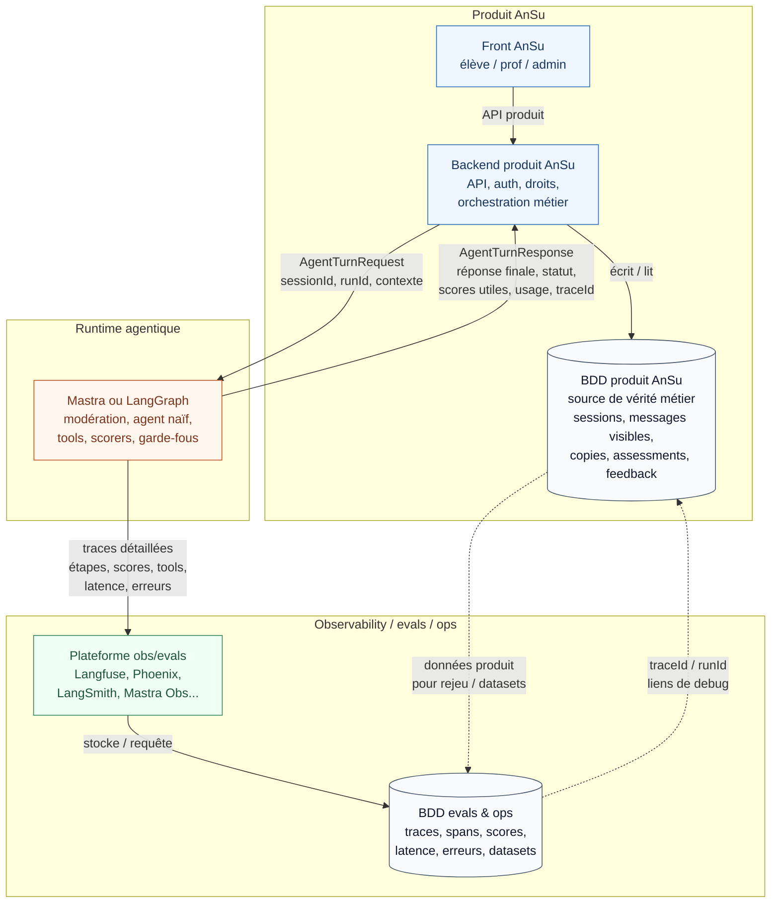

# Traces prioritaires AnSu v5

> **Statut : brouillon de cadrage.** Objectif : clarifier ce qu’AnSu doit pouvoir tracer pour piloter le MVP, puis réutiliser cette liste comme checklist dans le benchmark observability/evals.

## 1. Pourquoi ce document ?

Le MVP AnSu v5 devra faire tourner un agent pédagogique avec plusieurs étapes critiques :

```txt
message élève
→ modération / prompt injection
→ agent naïf
→ garde-fou avant sortie
→ réponse finale
```

Les outils observability/evals ne doivent pas seulement afficher de jolies traces : ils doivent aider l’équipe à répondre à des questions concrètes.

Pour Mathieu :

```txt
Est-ce que l’agent aide vraiment les élèves ? Où bloquent-ils ? Qu’est-ce que les profs doivent pouvoir revoir ?
```

Pour Thomas / tech :

```txt
Peut-on comprendre, auditer, débugger, exporter et sécuriser ce qui s’est passé ?
```

Principe de séparation :

```txt
Base métier AnSu = source de vérité produit.
Outil observability/evals = debug, inspection, évaluation, comparaison, alerte.
```

Une trace critique peut donc être présente dans les deux, mais l’outil d’observability ne doit pas devenir l’unique détenteur des données produit critiques.

Note de lecture : quand la source indique `Base métier + copie obs`, la base AnSu reste la référence. L’outil observability reçoit une copie pour filtrer, comprendre ou comparer les traces.

## 1.1 Architecture logique des traces



À retenir :

```txt
Le front parle au backend produit, pas directement au runtime agentique.
La BDD produit AnSu conserve la vérité métier.
La BDD evals & ops conserve les traces détaillées, scores, erreurs et jeux d’évaluation.
Le runtime exécute le pipeline agentique et alimente les deux mondes : réponse utile au produit, traces utiles au debug/evals.
Les IDs de corrélation relient BDD produit et BDD evals/ops sans faire de l’outil obs la source de vérité métier.
```

## 2. Traces agentiques / techniques

| Élément à tracer                                                 | Ce que ça trace                                                                                                                               | Pourquoi c’est utile                                                                                                                                                                             | Priorité                                       | Source de vérité                                                  | À prouver dans le bench observability/evals                                                                                                                    |
| ---------------------------------------------------------------- | --------------------------------------------------------------------------------------------------------------------------------------------- | ------------------------------------------------------------------------------------------------------------------------------------------------------------------------------------------------ | ---------------------------------------------- | ----------------------------------------------------------------- | -------------------------------------------------------------------------------------------------------------------------------------------------------------- |
| IDs de corrélation                                               | `sessionId`, `turnId`, `runId`, `traceId`, éventuellement `userId` pseudonymisé                                                               | Recomposer une session complète et relier base métier, runtime et outil obs                                                                                                                      | Critique                                       | Base métier ; indexés dans obs                                    | Filtrer/rechercher/exporter par ces IDs                                                                                                                        |
| Messages conversationnels visibles                               | Messages envoyés par l’élève + réponses finales réellement affichées par l’agent                                                              | Reconstituer la conversation, permettre la relecture prof, les copies rendues et l’audit pédagogique ; donner assez de contexte dans les dashboards obs pour comprendre une trace                | Critique                                       | Base métier ; copie/extrait dans obs                              | Vérifier que l’outil obs affiche assez de contexte sans devenir source de vérité, avec anonymisation si besoin                                                 |
| Étapes intermédiaires de modération / appels outils / garde-fous | Décisions de modération, appels tools, réponse brute avant garde-fou, réparation ou fallback                                                  | Comprendre pourquoi une réponse finale a été envoyée, modifiée, bloquée ou remplacée                                                                                                             | Critique                                       | Observability/evals ; résumé en base si impact produit            | Voir le chemin modération → agent/tool → garde-fou → réparation/fallback → réponse finale                                                                      |
| Scores / évaluations automatiques \*                             | Scores produits par des scorers ou evals : naïveté, qualité pédagogique, sécurité, respect du niveau, réussite d’un objectif                  | Mesurer la qualité des réponses, comparer les versions d’agent/prompt et détecter les régressions                                                                                                | Critique                                       | Les deux                                                          | Stocker, afficher, filtrer et exporter les scores avec leur version, leur cible et la réponse évaluée                                                          |
| Versions agent/prompt/scorer                                     | Versions de l’agent, du prompt système, de la modération et du garde-fou utilisés pour produire une réponse                                   | Expliquer une réponse passée, comparer les comportements et éviter les régressions                                                                                                               | Critique                                       | Base métier + copie obs                                           | Filtrer/comparer par version                                                                                                                                   |
| Provider / modèle / runtime                                      | Provider, modèle, runtime et paramètres principaux utilisés pour produire la réponse                                                          | Comparer les architectures, expliquer les écarts de comportement et diagnostiquer les problèmes provider                                                                                         | Critique                                       | Base métier + copie obs                                           | Filtrer/comparer par provider, modèle et runtime                                                                                                               |
| Usage tokens                                                     | Tokens consommés par le run et, si possible, par étape ; mesure issue du provider/runtime                                                     | Suivre les coûts, détecter les prompts trop lourds et comparer les architectures                                                                                                                 | Critique                                       | Les deux                                                          | Visualiser/filtrer tokens par run, étape, version et provider                                                                                                  |
| Coût et impacts provider                                         | Coût et impacts environnementaux quand le provider les renvoie, notamment Albert (`usage.cost`, `usage.impacts.kWh`, `usage.impacts.kgCO2eq`) | Arbitrer coût/impact, comparer les architectures et anticiper le passage à l’échelle ; tous les providers ne renvoient pas ces données, donc la stratégie de fallback/estimation reste à creuser | Critique                                       | Les deux                                                          | Vérifier que ces champs sont conservés, filtrables ou exportables quand ils existent, et identifier ce que l’outil permet quand le provider ne les renvoie pas |
| Latence par étape                                                | Temps de réponse total et temps des étapes clés : modération, LLM, tools, garde-fou                                                           | Identifier ce qui ralentit l’agent et suivre la qualité d’expérience élève                                                                                                                       | Critique                                       | Observability + synthèse en base si besoin                        | Visualiser p50/p95, filtrer par étape, runtime, provider et version                                                                                            |
| Erreurs par étape                                                | Timeout, erreur provider, erreur de schéma, erreur tool, erreur d’export obs                                                                  | Débugger rapidement, mesurer la fiabilité et savoir si l’élève a reçu une réponse normale ou dégradée                                                                                            | Critique                                       | Observability ; statut/résumé en base si impact utilisateur       | Voir l’erreur avec son étape, son contexte et l’impact sur la réponse finale                                                                                   |
| Sources documentaires                                            | Documents, extraits ou IDs de sources utilisés par un tool/RAG, avec classe/prof/activité si applicable                                       | Vérifier que l’agent s’appuie sur les bons documents et permettre aux profs de faire confiance aux réponses                                                                                      | Utile ; Critique si RAG activé dans le POC     | Base documentaire pour les sources ; trace d’utilisation dans obs | Traces de sources filtrables/exportables, avec assez de contexte pour auditer une réponse                                                                      |
| Sorties structurées                                              | Schéma utilisé, validation, erreurs et résultat structuré produit par le LLM                                                                  | Alimenter “rendre ma copie”, les évaluations notionnelles et les tests de non-régression                                                                                                         | Critique                                       | Base métier + copie obs                                           | Afficher/exporter l’objet structuré, son schéma et son statut de validation                                                                                    |
| Reconstruction / rejeu de session                                | Données nécessaires pour retrouver une session passée et éventuellement la tester avec une nouvelle version d’agent/prompt                    | Comparer les versions, comprendre les régressions et transformer des cas réels en jeux de test                                                                                                   | Utile ; Critique plus tard pour non-régression | Base métier + datasets/evals                                      | Export complet avec messages, IDs, versions, scores et résultats                                                                                               |
| Données sensibles / anonymisation                                | Informations élèves à protéger, pseudonymisation, durée de conservation et accès aux traces                                                   | Protéger les données élèves et éviter que les outils de debug exposent trop d’informations                                                                                                       | Critique                                       | Base métier + règles d’accès ; obs anonymisée si besoin           | Vérifier anonymisation, contrôle d’accès et possibilité de limiter ou supprimer les traces                                                                     |

### \* La mécanique attendue des scorers

Un scorer n’est pas seulement une note affichée dans un dashboard. C’est une forme d’évaluation automatique exécutée en temps réel, au fil de l’eau, sur chaque génération LLM ou étape critique du pipeline. L’objectif est de suivre la qualité au niveau atomique : une réponse, un appel d’agent, une sortie structurée, un garde-fou.

Pour être exploitable, il faut pouvoir comprendre :

```txt
quelle réponse ou étape est évaluée,
par quel scorer,
avec quelle version,
sur quel critère,
à quel moment du pipeline,
avec quel score,
et quelle conséquence éventuelle sur la réponse finale.
```

Exemples de scorers utiles pour AnSu :

- naïveté pédagogique : l’agent guide-t-il l’élève sans donner directement la réponse ?
- qualité pédagogique : réponse adaptée au niveau et compréhensible ;
- sécurité / garde-fou : réponse acceptable avant affichage ;
- conformité au format : sortie structurée valide, sources présentes si attendues.

Un score utile doit donc idéalement contenir :

```txt
scoreName
scoreVersion
targetMessageId ou runId
score numérique ou décision
raison courte / evidence
action éventuelle : send, repair, block, fallback
```

Dans le benchmark observability/evals, on ne valide pas seulement “peut-on calculer un score ?”, mais surtout :

```txt
peut-on voir, filtrer, comparer et exporter ce score en lien avec la réponse évaluée et les versions agent/prompt/scorer ?
```

## 3. Signaux produit à corréler aux traces

Ces signaux ne sont pas nécessairement stockés dans l’outil observability. Ils appartiennent d’abord à la base métier AnSu. Le benchmark doit vérifier si les plateformes observability/evals permettent de les relier aux traces agentiques via des IDs, exports ou APIs.

| Signal produit           | Pourquoi le corréler aux traces                                                                         | À vérifier dans le bench observability/evals                                                        |
| ------------------------ | ------------------------------------------------------------------------------------------------------- | --------------------------------------------------------------------------------------------------- |
| Session ou copie rendue  | Relier une conversation réelle à ses traces techniques, scores, versions et coûts                       | Retrouver/exporter les traces via `sessionId`, `runId`, `submissionId` ou équivalent                |
| Assessment structuré     | Comprendre quelle sortie LLM a produit les notions, preuves et décisions pédagogiques                   | Afficher/exporter l’objet structuré, son schéma, son statut de validation et sa trace de génération |
| Feedback prof            | Transformer un signal humain en cas d’évaluation ou dataset réutilisable                                | Annotation, tag, export ou API exploitable pour créer des cas d’eval                                |
| Blocage / réparation     | Relier un problème visible côté produit à une décision de modération, garde-fou, réparation ou fallback | Filtrer les traces bloquées, réparées ou fallback, avec raison et version concernée                 |
| Coût/impact par activité | Relier coûts, tokens et impacts aux usages pédagogiques réels                                           | Exporter tokens/coût/impact avec activité, agent, version, runtime et provider                      |

## 4. Ce que chaque outil observability/evals devra prouver

Pour chaque plateforme testée — Mastra Observability, LangSmith, Phoenix, Langfuse, MLflow, Promptfoo — on devra vérifier au minimum :

1. Peut-on reconstruire une session complète à partir des traces ?
2. Peut-on filtrer par `sessionId`, `runId`, agent, version, provider, runtime ?
3. Peut-on afficher et exporter les étapes du pipeline MVP ?
4. Peut-on stocker/filtrer un score pédagogique custom ?
5. Peut-on visualiser latence, erreurs, tokens, coût et impacts Albert ?
6. Peut-on exporter les traces/scores sans lock-in ?
7. Peut-on corréler les traces avec la base métier AnSu ?
8. Peut-on protéger les données sensibles : auth, RBAC, redaction, rétention ?
9. L’outil respecte-t-il sa frontière : debug, inspection, evals et export — sans devenir le dashboard produit/prof ni la source de vérité métier ?
10. Quelles fonctionnalités sont SaaS/Enterprise/non self-host ?

## 5. Points probablement manquants à challenger

Questions à garder ouvertes pendant le benchmark :

- Quelle granularité minimale suffit pour le MVP : run entier, étape, ou token/stream ?
- Quelle trace doit être gardée longtemps, et laquelle peut expirer vite ?
- Quel niveau de pseudonymisation est acceptable pour les traces debug ?
- Les profs doivent-ils voir certains scores/traces, ou seulement des synthèses produit ?
- Faut-il pouvoir rejouer une session passée contre une nouvelle version d’agent dès le MVP ?
- Comment transforme-t-on un feedback prof en cas d’évaluation réutilisable ?

## 6. Utilisation dans le benchmark

Ce document complète `QUESTIONS_STRUCTURANTES.md`, section B.

Lors de la fiche d’un outil observability/evals :

1. Parcourir les lignes `Critique` des deux tableaux.
2. Pour chaque ligne, indiquer : `Validé`, `Partiel`, `Non validé`, `Non applicable`, `Reporté`.
3. Ajouter une preuve : capture, trace, API/export, code d’intégration ou doc officielle.
4. Ne pas compter comme validé un champ seulement présent dans la réponse brute runtime s’il disparaît dans l’outil obs/export.
5. Reporter les écarts importants dans la synthèse scénario.
