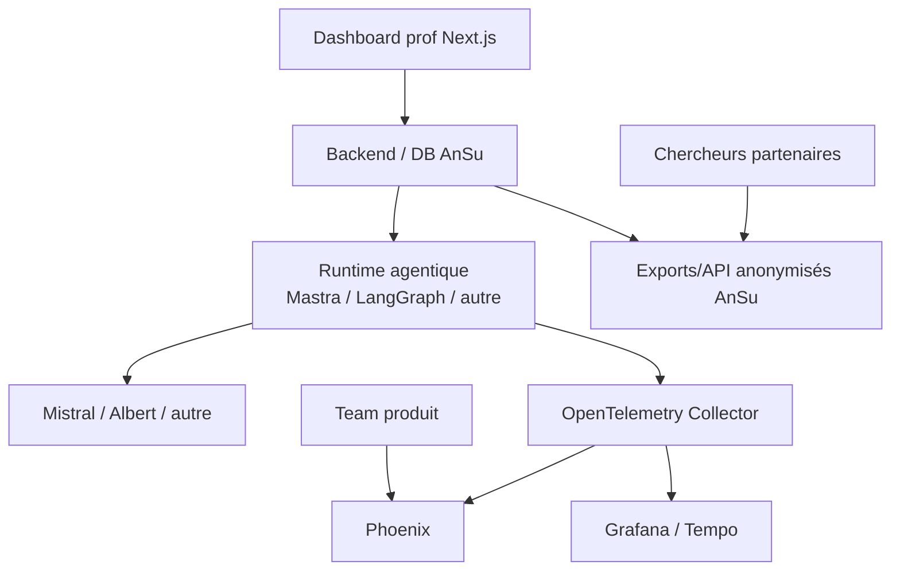

# Conclusions provisoires — Arize Phoenix pour AnSu v5

> **Statut : archive historique.** Phoenix est repassé en `Non testé` pour la nouvelle grille observability/evals ; ce document est conservé pour mémoire seulement.

## Verdict en une phrase

Phoenix est une très bonne brique d'**observabilité**, d'**évaluation** et d'**inspection produit** pour AnSu, mais ne peut pas porter seul la fabrique d'agents : il doit être accompagné d'un runtime agentique et d'une couche métier AnSu.

## Recommandation

**À garder dans la stack candidate**, mais avec un rôle clair :

```txt
Phoenix = observabilité + evals + traces + datasets + experiments + UI d'inspection produit
```

Phoenix ne doit pas être considéré comme :

```txt
Phoenix ≠ runtime agentique complet
Phoenix ≠ registry métier des agents AnSu
Phoenix ≠ dashboard prof final
Phoenix ≠ DB métier principale
```

## Positionnement dans l'architecture cible



Lecture :

- les profs utilisent une UI Next.js construite par AnSu ;
- la team produit inspecte/debugge dans Phoenix ;
- les chercheurs accèdent à des exports/API anonymisés contrôlés par AnSu ;
- Phoenix reçoit les traces et résultats d'evals, mais ne remplace pas la DB métier.

## Ce que le POC a validé

Un dossier de test a été créé :

```txt
pocs/observability/phoenix/
```

Il contient :

- Phoenix self-hosté avec Docker ;
- une mini app LangChain instrumentée OpenTelemetry/OpenInference ;
- un exemple de fan-out OpenTelemetry Collector vers Phoenix + Grafana Tempo ;
- une fiche d'évaluation ;
- un mini dashboard Next.js branché sur l'API REST Phoenix.

Le dashboard Next.js est dans :

```txt
pocs/observability/phoenix/dashboard-next/
```

Il démontre :

- lecture des projets Phoenix ;
- lecture des traces ;
- lecture des spans d'une trace ;
- lecture/écriture d'annotations de feedback prof ;
- gestion POC des prompts ;
- gestion POC des critères d'evals ;
- création POC de datasets/experiments/runs/evaluations.

## Matrice synthétique

| Critère                         | Évaluation Phoenix | Commentaire                                                                                                                           |
| ------------------------------- | ------------------ | ------------------------------------------------------------------------------------------------------------------------------------- |
| Bootstrap octobre, agent unique | 🟡 Partiel         | Très utile pour observer/évaluer le POC, mais ne fournit pas le runtime de l'agent.                                                   |
| Runtime agentique               | ❌ Non             | Phoenix observe des agents, mais ne les exécute pas comme runtime principal.                                                          |
| Registry agent métier           | ❌ Non             | Pas de notion complète d'agent AnSu versionné/configurable/déployable.                                                                |
| Prompt master                   | 🟡 Partiel         | Prompt management/versioning disponible. REST exploitable pour le POC, mais à tester endpoint par endpoint avant dépendance critique. |
| Variables de prompt profs       | ❌ Non natif       | Variables matérialisées comme placeholders Mustache dans le template, pas comme objets first-class. Schema métier à porter côté AnSu. |
| Modération input/output         | 🟡 Observable      | Phoenix peut tracer guardrails/modération ; la logique doit être dans le runtime AnSu.                                                |
| Anti-dérive / naïveté           | 🟡 Évaluable       | Phoenix peut stocker/tracer/evaluer les dérives ; la détection/correction doit être construite.                                       |
| Traces pédagogiques             | ✅ Fort            | Très bon modèle traces/spans, annotations, sessions. À adapter pour dashboard prof.                                                   |
| Evals / non-régression          | ✅ Fort            | Datasets, experiments, runs, evaluations, annotations. Runner applicatif nécessaire.                                                  |
| Recherche / preuve d'impact     | 🟡 Bon potentiel   | Datasets/experiments utiles ; anonymisation, cohortes et exports chercheurs à porter côté AnSu.                                       |
| Observabilité OpenTelemetry     | ✅ Fort            | OTLP HTTP/gRPC, OpenInference, spans typés, intégrations nombreuses.                                                                  |
| Grafana / Tempo                 | 🟡 Faisable        | Prévoir un OTel Collector en fan-out : app → collector → Phoenix + Tempo.                                                             |
| API dashboard Next              | ✅ Validé POC      | REST API suffisante pour une première façade Next ; GraphQL peut rester nécessaire pour certains usages avancés.                      |
| SecNumCloud / socle compatible  | 🟡 Potentiel       | Self-host Docker/Helm, Postgres possible, télémétrie désactivable. Pas d'offre SecNumCloud native identifiée. Licence à valider.      |
| Licence / open source           | 🟡 À vérifier      | Code disponible sous Elastic License 2.0, pas MIT/Apache. Implications institutionnelles à vérifier.                                  |
| Dashboard prof final            | ❌ Non             | L'UI Phoenix doit rester réservée à la team produit/tech.                                                                             |

Légende : ✅ bon fit ; 🟡 utile mais incomplet/à cadrer ; ❌ ne couvre pas le besoin.

## Ce que Phoenix fait bien

### Observabilité LLM

Phoenix est construit autour d'OpenTelemetry/OpenInference. Il sait recevoir des traces OTLP et les visualiser sous forme exploitable pour les applications LLM.

Points validés ou documentés :

- ingestion OTLP HTTP `/v1/traces` ;
- ingestion OTLP gRPC `4317` ;
- spans typés : agent, LLM, chain, prompt, guardrail, evaluator, retriever ;
- projets séparés ;
- UI d'inspection ;
- Prometheus possible ;
- télémétrie éditeur désactivable.

### Evals, datasets et experiments

Phoenix fournit un modèle utile pour structurer les campagnes d'évaluation :

```txt
dataset → experiment → runs → evaluations
```

Cela correspond bien au besoin de :

- rejouer une version d'agent/prompt sur un corpus de référence ;
- comparer des versions ;
- stocker des scores ;
- associer des annotations humaines ou automatiques ;
- constituer une base de non-régression.

### Feedback humain / annotations

Phoenix permet d'ajouter des annotations sur :

- traces ;
- spans ;
- sessions ;
- experiment runs.

Cela se prête bien aux feedbacks profs et aux jugements de l'équipe produit.

### API exploitable depuis Next.js

Le POC Next a validé que l'on peut construire une UI métier séparée qui consomme Phoenix côté serveur.

Endpoints testés :

- `GET /v1/projects`
- `GET /v1/projects/:project/traces`
- `GET /v1/projects/:project/spans?trace_id=...`
- `GET /v1/projects/:project/trace_annotations?trace_ids=...`
- `POST /v1/trace_annotations`
- `GET /v1/prompts`
- `POST /v1/prompts`
- `GET /v1/prompts/:prompt/versions`
- `POST /v1/prompt_versions/:version/tags`
- `GET /v1/annotation_configs`
- `POST /v1/annotation_configs`
- `GET /v1/datasets`
- `POST /v1/datasets/upload`
- `GET /v1/datasets/:id/examples`
- `POST /v1/datasets/:id/experiments`
- `POST /v1/experiments/:id/runs`
- `POST /v1/experiment_evaluations`

## Ce que Phoenix ne fait pas seul

### Pas de runtime agentique

Phoenix observe des agents mais ne fournit pas le moteur d'exécution complet :

- orchestration du dialogue ;
- rendu métier du prompt ;
- appel modèle ;
- guardrails runtime ;
- boucle anti-dérive ;
- streaming élève ;
- fallback modèle/modération ;
- mémoire de dialogue.

Il faut donc une brique runtime : Mastra, LangGraph/LangChain ou équivalent.

### Pas de registry agent AnSu

Le wiki produit définit des concepts métier que Phoenix ne porte pas comme agrégats :

- cas d'usage ;
- modèle de séquence ;
- séquence ;
- posture ;
- garde-fou ;
- agent naïf ;
- dérive ;
- atelier ;
- dialogue ;
- contrat didactique ;
- configuration prof.

Ces concepts doivent vivre dans la DB/backend AnSu.

### Variables de prompt non first-class

Phoenix stocke les variables dans le template :

```txt
{{niveau_scolaire}}
{{matiere}}
{{nom_eleve}}
```

Mais il n'expose pas, à ce stade, d'API REST dédiée aux variables comme objets métier :

```txt
/prompt_variables
```

Recommandation : AnSu doit stocker le schema de variables :

- nom technique ;
- label ;
- type ;
- required ;
- options ;
- valeur par défaut ;
- validation ;
- caractère PII ;
- aide utilisateur.

## Points techniques observés

### Stockage local

Dans le POC Docker, Phoenix utilise SQLite :

```txt
/data/phoenix.db
/data/phoenix.db-shm
/data/phoenix.db-wal
```

Le volume Docker est :

```txt
pocs/observability/phoenix_phoenix-data
```

Pour la production, Phoenix supporte PostgreSQL via `PHOENIX_SQL_DATABASE_URL` ou variables Postgres dédiées.

### Prompt management

Observations :

- le modèle REST expose `PromptStringTemplate` et `PromptChatTemplate` ;
- mais `POST /v1/prompts` refuse les templates `STR` avec le message : `Only CHAT template type is supported for prompts` ;
- le POC crée donc des prompts `CHAT` ;
- la liste `ModelProvider` du prompt management ne contient pas Mistral/Albert ;
- Phoenix peut toutefois tracer Mistral via OpenInference.

Conclusion : le prompt management Phoenix est utile, mais ne doit pas être accepté sans vérification pour le cas Mistral/Albert.

### API REST

La REST API fonctionne pour beaucoup de besoins POC. Elle est exploitable, mais elle présente quelques aspérités observées pendant le test :

- certains endpoints répondent avec un body vide malgré succès, par exemple l'ajout d'un tag de version de prompt ;
- `POST /v1/datasets/upload` a répondu `null` tout en créant bien le dataset, ce qui oblige à refaire un `GET` pour retrouver l'objet créé ;
- le schéma OpenAPI expose `PromptTemplateType = STR | CHAT`, mais `POST /v1/prompts` refuse les templates `STR` avec `Only CHAT template type is supported for prompts` ;
- le modèle `ModelProvider` du prompt management REST ne liste pas Mistral/Albert, alors que Phoenix sait tracer Mistral via OpenInference ;
- Phoenix semble historiquement disposer aussi d'une API GraphQL plus riche, qui pourrait être nécessaire pour certains usages avancés.

Conclusion : REST est suffisant pour le POC dashboard Next, mais il faut tester les endpoints un par un avant d'en faire une dépendance produit critique.

## Recherche et preuve d'impact

Phoenix est intéressant pour construire une base de mesure :

- traces de dialogues ;
- annotations ;
- datasets ;
- experiments ;
- scores ;
- comparaisons de versions.

Mais la couche recherche AnSu doit probablement gérer :

- consentement ;
- anonymisation ;
- cohortes ;
- exports chercheurs ;
- séparation données opérationnelles / données recherche ;
- documentation des protocoles ;
- droits d'accès ;
- suppression/rectification.

Phoenix peut alimenter la preuve d'impact, mais ne doit pas être la seule gouvernance de recherche.

## Risques

| Risque                                                       | Niveau     | Mitigation                                                    |
| ------------------------------------------------------------ | ---------- | ------------------------------------------------------------- |
| Confondre Phoenix avec un runtime agentique                  | Élevé      | Le positionner clairement comme observabilité/evals.          |
| Mettre les variables profs uniquement dans Phoenix           | Moyen      | Stocker schema et valeurs dans AnSu DB.                       |
| Stocker des PII dans les traces                              | Élevé      | Pseudonymisation, redaction, minimisation, rétention.         |
| S'appuyer sur prompt management sans vérifier Mistral/Albert | Moyen      | Tester providers cibles et prévoir source de vérité AnSu.     |
| REST API partiellement rugueuse                              | Moyen      | BFF Next robuste, tests d'intégration, GraphQL si nécessaire. |
| Licence Elastic License 2.0                                  | À vérifier | Validation juridique/DevSecOps avant adoption critique.       |
| Dépendance UI Phoenix pour les profs                         | Élevé      | UI prof exclusivement Next/AnSu.                              |

## Décision provisoire

Phoenix mérite de rester dans la stack candidate comme **brique transverse** :

```txt
observabilité + evals + traces + inspection produit
```

Il ne répond pas seul au besoin AnSu. Le prochain choix structurant est le runtime agentique :

```txt
Mastra + Phoenix ?
LangGraph/LangChain + Phoenix ?
Autre runtime + Phoenix ?
```

## Prochaines vérifications Phoenix

Avant décision finale :

1. tester avec un vrai appel Mistral ;
2. tester Albert API dès accès disponible ;
3. vérifier export OTel Collector vers Grafana/Tempo ;
4. vérifier auth/users/roles Phoenix self-host ;
5. vérifier Postgres en self-host ;
6. vérifier stratégie PII/redaction ;
7. vérifier implication licence ELv2 ;
8. tester extraction/export anonymisé pour chercheurs ;
9. vérifier si REST suffit ou si GraphQL devient nécessaire.
